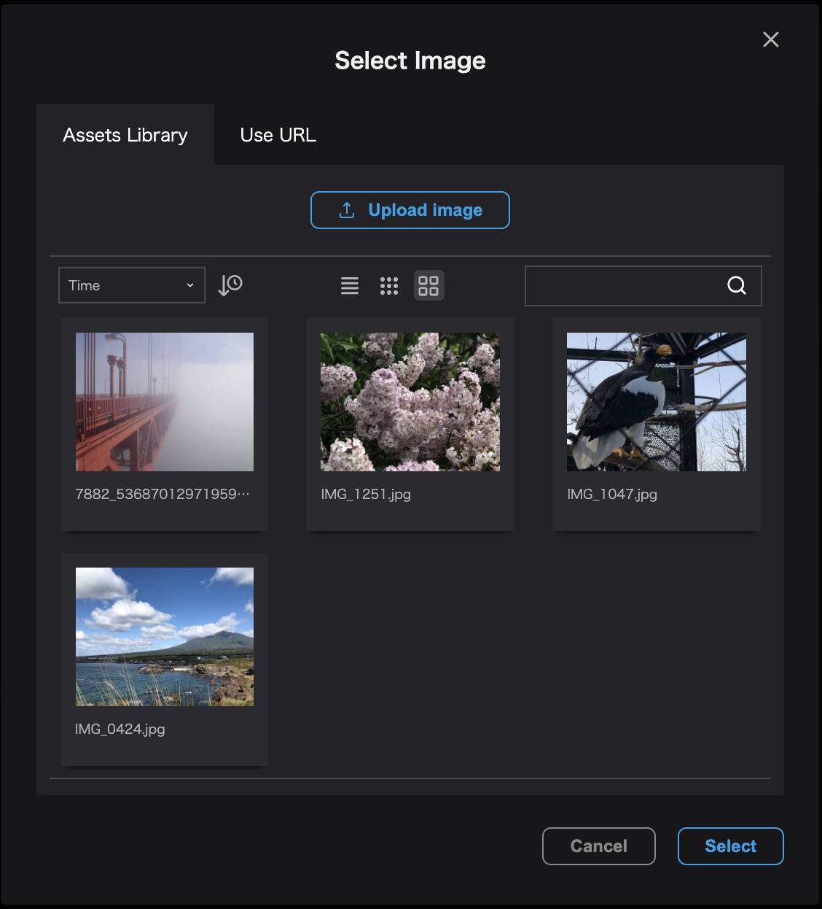
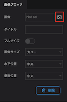
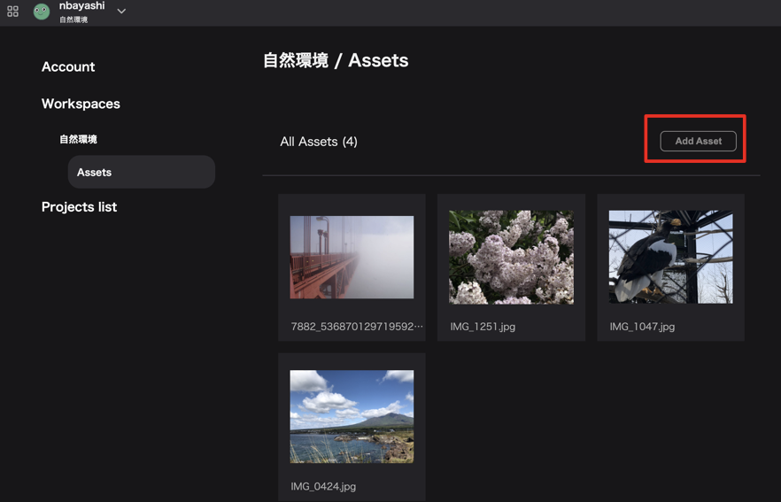

## How to add an asset

The following techniques can be used to add assets.

- Adding one image at a time
- Adding multiple images at once

## Add one piece at a time.

You can add assets during image selection through the assets modal when customizing the following:

- Project thumbnails
- Infobox's image block image
- Photo overlay image
- Splash screen image
- Marker icons
- Profile image

By uploading an image, it will be added as an asset and can be used in any Re:Earth project that share the same workspace.

### Project thumbnail and profile images

The asset modal is displayed by clicking the edit button of the image when creating a new project or on the Profile field of the Account settings page.

(See [here](../project-and-workspace/create-new-project) for more information on creating a project)

### **Icons, infobox image blocks, photo overlays, splash screens and markers**.

Clicking on the image icon when available in property settings will bring up the asset modal.

Propety of Infobox
(For more information about infobox, click [here](../infobox/set-up-infobox-properties))

Propety of Photo overlay

Propety of Marker

Make sure the `Image` tab is select.

Select the image you want to upload from among the images on your device and press the `Open` button.

## Add multiple images at once.

### Open the account settings screen.

Open `Account Settings` -> `Workspace` -> `Assets`.

Press the `Add Asset` button on the right side of the asset list.

Select an image from your device (you can select multiple) and click the `Open` button to upload the asset and use it in your Re:Earth project.
