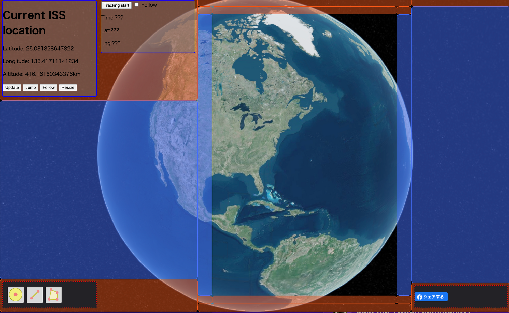
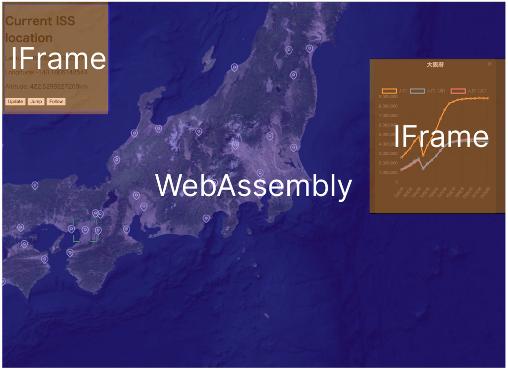

# Type of plugin

## Re-Earth has two types of plugins:

**"Widget Plugins" and "Info Box Plugins.”**

Both types of plugins serve different purposes and can be customized and integrated into Re-Earth's platform to enhance the overall functionality and user experience.

### Widget Plugins

Widget Plugins are a type of plugin where the plugin's content is displayed on the screen.

Widgets can be placed freely at the edge or corner of the screen. They allow you to toggle the display of various data or perform actions on any active layer within Re-Earth. With Widget Plugins, you have the flexibility to customize and control the visibility and interaction of specific content on the screen.

### InfoBox Plugin

InfoBox Plugins are plugins that appear in the InfoBox when a layer is selected.

These plugins allow you to display various data based on the selected layer's content. They provide additional information, context, or details related to the selected layer, enhancing the user's understanding and interaction with the displayed data. InfoBox Plugins offer a convenient way to present relevant information associated with a specific layer in Re-Earth.

## ****Plugin Structure****

When creating plugins for Re-Earth, it is important to understand the underlying execution environments: "**WebAssembly**" for the map display and "IFrame" as the execution environment for plugins such as widgets and InfoBoxes.

### **WebAssembly**

WebAssembly allows you to synchronize your code for faster execution and access to Re-Earth data. However, you cannot use the APIs supported by web browsers or create UI using HTML.

Using WebAssembly, you can accomplish the following:

- Retrieve information about Re-Earth scenes and layers
- Utilize plugin APIs to perform operations within Re-Earth.
- Send data to the IFrame side using **`reearth.ui.postMessage`** and receive data from the IFrame side using **`reearth.on("message", () => {})`**.

### IFrame

IFrames (HTML embedding elements) are responsible for constructing widgets and info boxes, allowing the use of any API supported by web browsers and the display of HTML content. However, direct access to Re-Earth data is not possible.

Within the IFrame, you can do the following:

- Utilize any API provided by the web browser, just like a regular HTML page.
- Communicate with the WebAssembly side using **`parent.postMessage`** and **`window.addEventListener("message", () => {})`**.

IFrame allows the rendering of HTML content just like a regular HTML page.