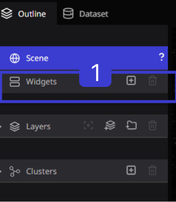
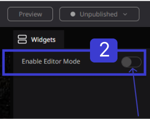
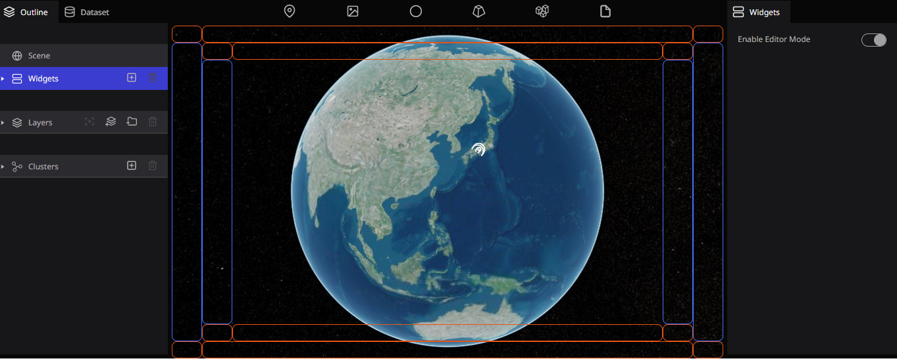

# Editor mode

Editor mode in the Re-earth app refers to the mode where users can access and edit the digital twin of a real-world location in the Re-Earth app. In this mode, users can modify the various elements that make up the digital twin Re-Earth.

Users can also make changes to the properties of these elements, such as their height, color, texture, and location. The editor mode allows users to visualize the impact of their changes on the environment, and test different scenarios and design options.

The editor mode is typically used by architects, urban planners, and designers to create and simulate new development projects, optimize the layout of buildings and infrastructure, and evaluate the environmental impact of different designs.

## How to set up the Editor Mode.

**Step 1.** From the Outline tab in the left panel, click `Widget`.

**Step 2.** The configuration window 'Edit widget **sequence**' will appear on the right panel. Click on **Activate** to activate it

The layout will appear to allow editing of widget placement.

