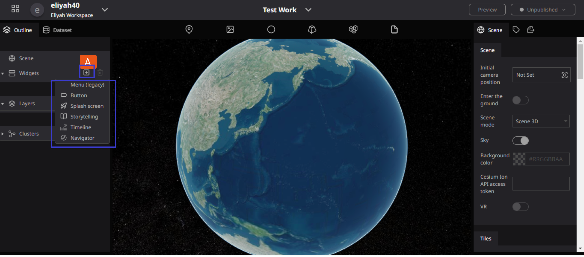
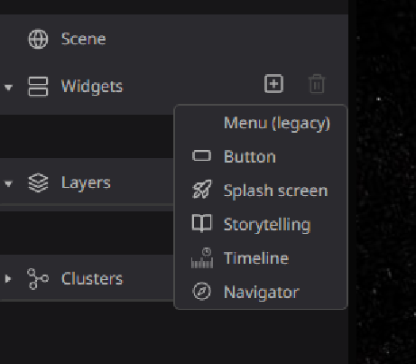

# Idea of widget

## What is Widget

**Widget** is a general term for other features that are not placed on the Re-Earth but are placed flat over the scene on the Screen of the Re-Earth App. 

**The widgets that Re-Earth currently provides are as follows:**

- **Button:** operates any event (such as camera movement or linking to an external site)
- **Splash Screen:** sets the screen displayed when starting a text project
- **Storytelling:** moves the layers on the project in order
- **Timeline:** switches the display of data according to time
- **Navigator:** allows for easy exploration of locations on the earth with simple operations.
    
    
    

**To Locate Widgets in the project panel, Click on the pulse icon (+), and the widgets dropdown will pop up.**

[**Button**](https://www.notion.so/Button-414b7868aa45461a93bfe9677cbe550a?pvs=21)