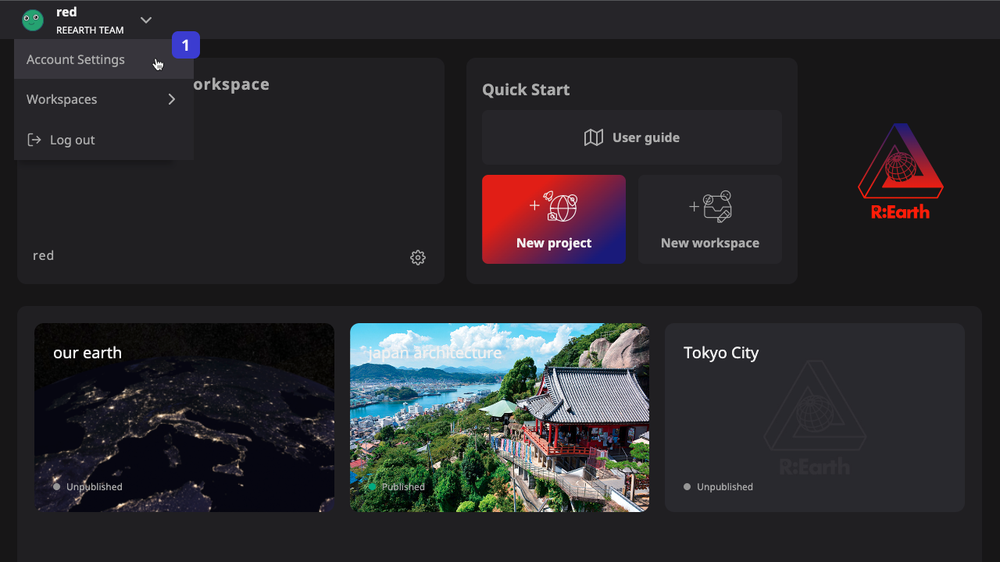
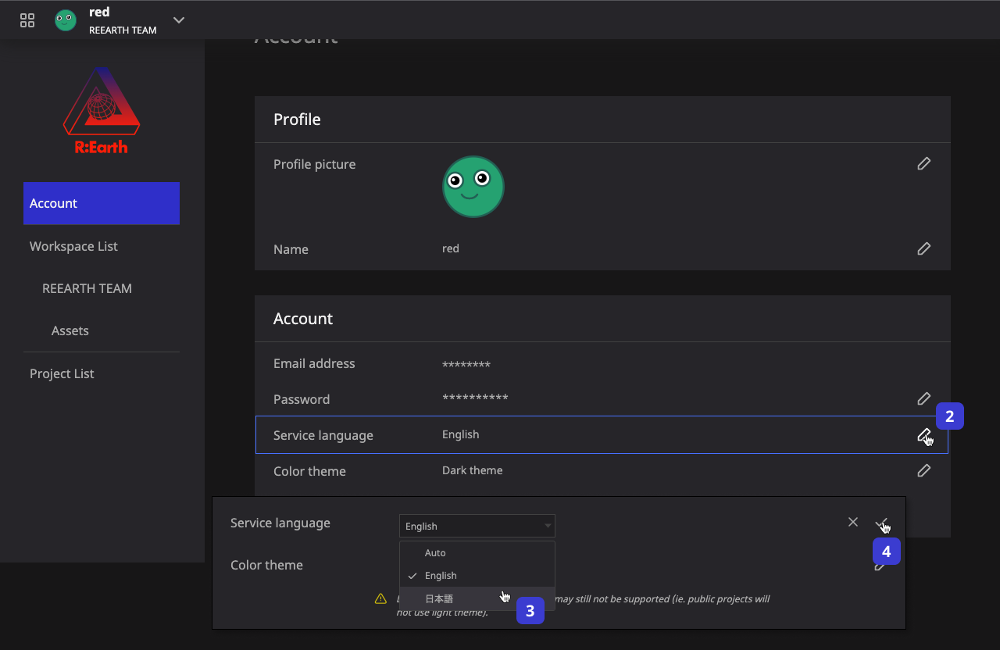
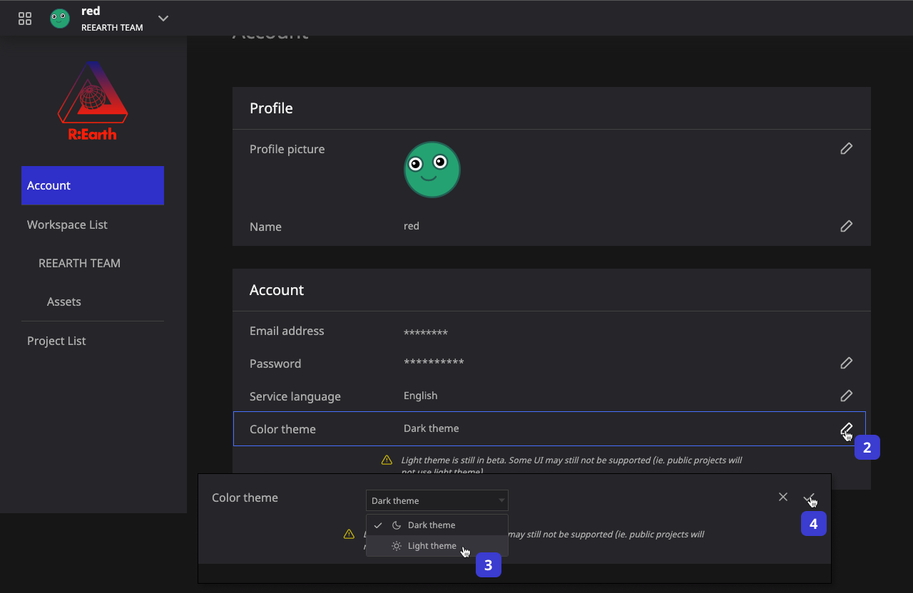

# ****Environment setting****

### Browser setup

Re: Earth is an application that runs on a web browser.

It is compatible with all desktop, OS's (Windows, macOS, Linux, Chrome OS) as well as mobiles, OS's (iOS, Android) that can run modern web browsers.

### Internet connection 

Re: Earth requires an Internet connection to operate. This means that offline works are not supported at this time.

If the Internet connection is lost while using Re:Earth, your changes may not be saved properly.

### Supported Web Browsers 

- Chrome 58+
- Firefox 57+
- Safari 11+ (macOS only)
- Microsoft Edge XX or later
- iOS(11+) Safari
- Android(10+) Chrome

To maintain comfortable operation and security, please update your web browser periodically to use the latest version.

Internet Explorer is not officially supported. Because it does not work with all versions Re:Earth.

### Supported OS 

- Windows 10
- Apple macOS 10.12 (macOS Sierra)+
- Linux running the above desktop web browsers
- Chrome OS
- iOS 11+
- Android 10+

### Supported Display Monitors 

For efficient editing with Re: Earth, a monitor with a resolution of 1000x700 pixels or higher is required.

As long as the screen of your device supports this resolution, you can use Re: Earth on desktop PCs, laptops, and tablets such as iPad without any problems.

Projects created and published with Re: Earth are able to be viewed on iPhone and other smart phone.

However, the editing screen of Re: Earth does not support smartphone.

### Graphics cards 

Re: Earth uses WebGL to display the globe.

Therefore, Re :Earth requires a graphics card or graphics chip that supports WebGL. Many of PCs and Tablets CPUs used it in recent time, as well as many mobile devices, has built-in graphics chips, and Re :Earth will run without any problems in most cases.

If you want to work more comfortably on a desktop PC, we recommend installing a graphics card such as the recently released Nvidia GeForce series or AMD Radeon series.

For the best performance, please update your graphics card or graphics chip driver regularly to use the latest version.

## **Language switch**

Re: Earth supports two languages at least , English and Japanese. now our development team has members from a wide variety of language backgrounds, we will work to support more languages in the future.

You can find switching the languages feature in the settings page of account.

- Dashboard header -> Account Settings

## **Color theme switch**

Re:Earth system provides two UI color themes, **Light theme** and **Dark theme**, which you can switch between them at anytime according to your needs.

The feature of switching between the UI color themes are available on the account setting page.

- Dashboard header > Account Settings

