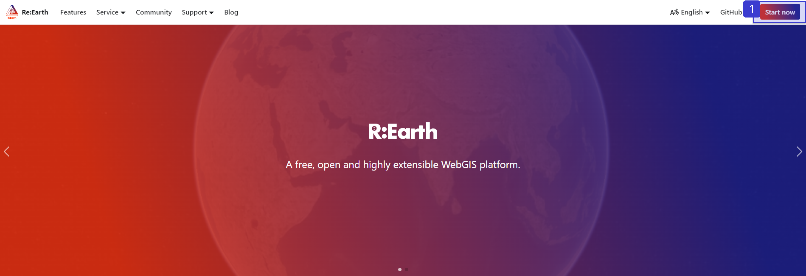
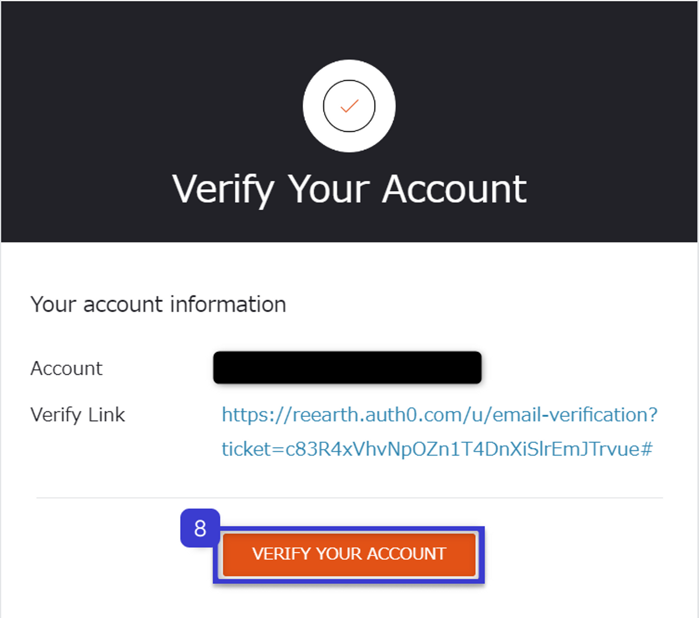
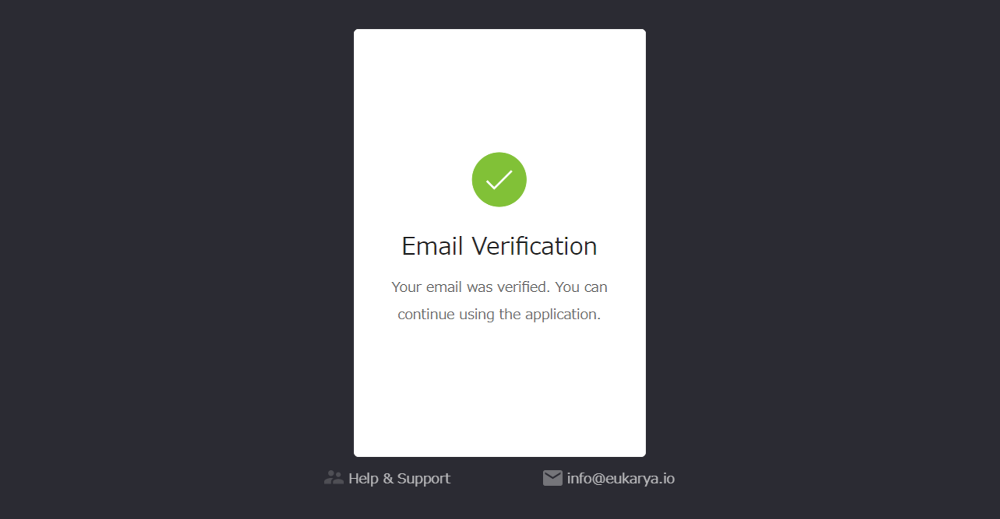
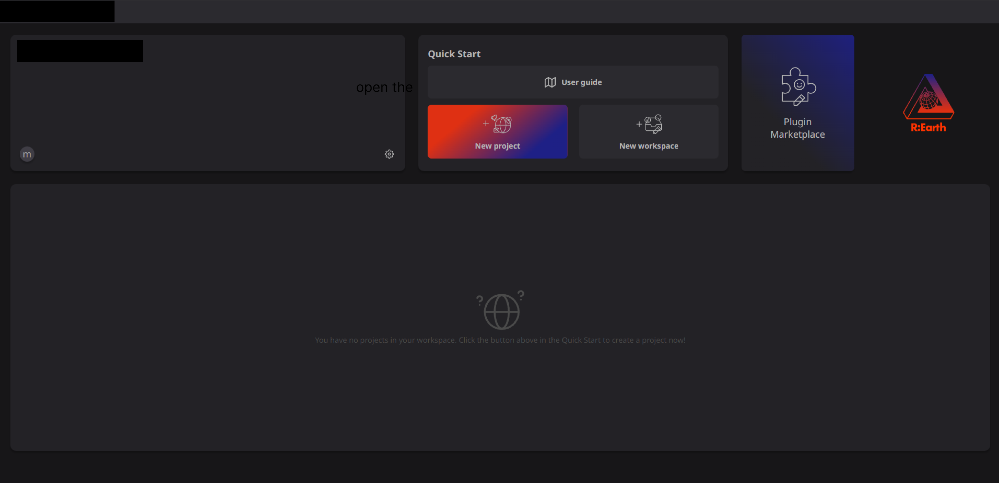

 
# **Making your first project**

### **Overview**

In this section, we will quickly Demonstrate the most basic Re: Earth processes to help you complete and publish your first Re: Earth project.

Let's start!

### **Starting a new account**

Because Re: Earth is still in the stage of internal development, as we do not yet support a public registration account. So please contact us through [here](https://docs.google.com/forms/d/e/1FAIpQLSftlA7HKfSsCHND14jERCLh3YzDETj0tU2rPVHM8McQfPHt-g/viewform) and we will open a new account for you.

After obtaining an account and completing verification, please open https://app.reearth.io/ and enter your account information to login.

**convert to the user registration screen**

② Click Sign Up

③ Enter your email address

④ Set the user name

⑤ Set password

⑥ Select the check box

⑦ Click Click Sign Up

**A verification Email will be sent to the email address you set**

⑧ Click "VERIFY YOUR ACCOUNT”

**Once the authentication is complete, the account issuance procedure is complete.**

## Login

open this URL

https://app.reearth.io/ 

① Click "Start now" at the top right of the screen

**convert to the user registration screen**

②  Click Login

③ Enter your username/email address

④ Enter password

⑤ Click Login

**You have successfully logged in**

