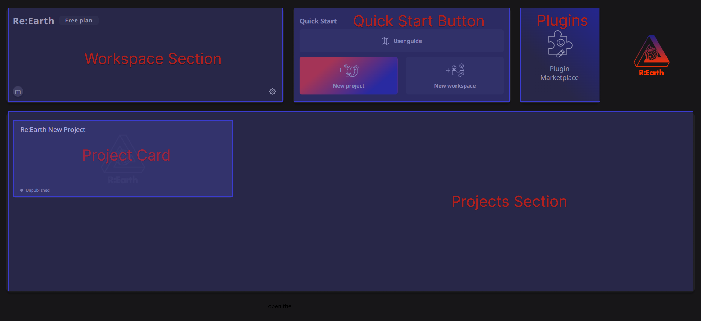
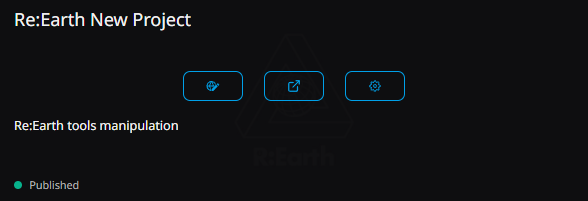

# **Dashboard**

After successfully logging into the application, you will be taken to the home screen (dashboard). This is the home page of the application and offers some useful features.

- **Workspace Section :**  displays the current Workspace you are in, including members' avatars. The ⚙️ button in the lower right corner can direct you to the current Workspace's settings page.
- **Project Section** : displays all projects under the current Workspace, except for archived projects.
- **Quick Start** : is a collection of quick operation buttons. We will add more buttons in the future.
- **Plugins** : allows you to configure plugin settings.
- **Project Card**

When moving your cursor over one Project Card, you can see more information(project name, description and public status). The three buttons will lead you to the Editor Page, Preview Page and Project Setting Page.

**in the future**

In future version updates, we plan to add other feature modules such as development changelogs, new feature introductions, and news from the community.