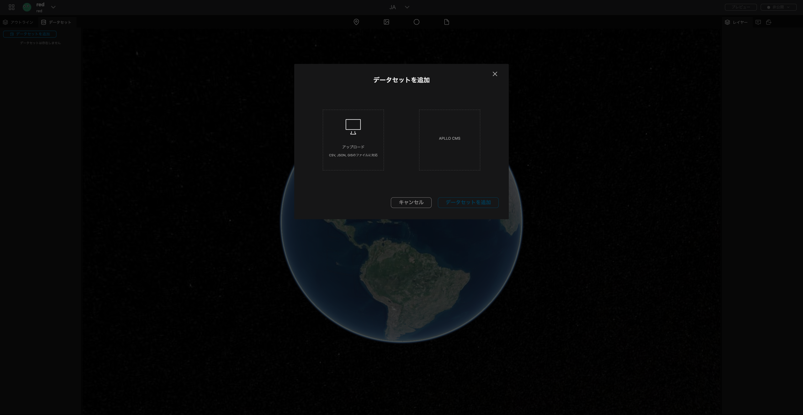
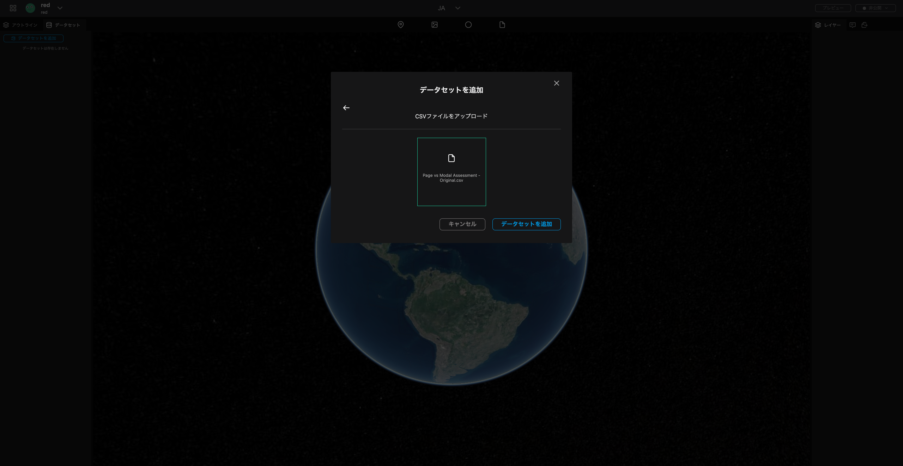
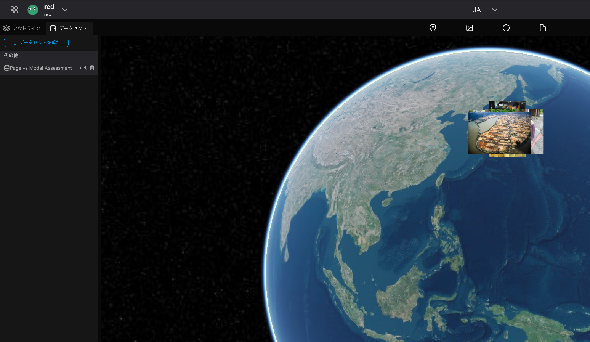

By importing data as a dataset, it is possible to use the values of the imported data for setting properties.
<!-- (For details, see [Link a Dataset to Property Field](../property/link-a-dataset-to-property-field)) -->

### Open the project.

Open the `Datasets` tab and click the `Add Dataset` button.

From the modal that appears, click `Upload`.

Select the desired CSV, JSON, or GIS file stored on your device and click the `Open` button.

Click `Add Dataset`.

The files you have uploaded to the dataset will be displayed in the left panel and you can drag from there and drop the file onto the earth to add them as layers.

