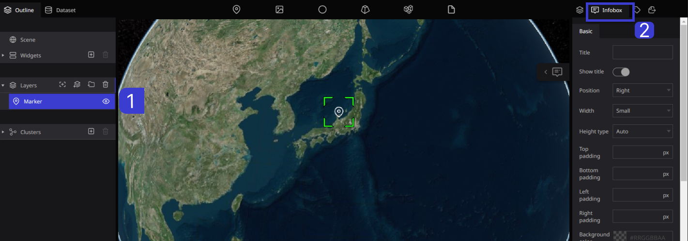
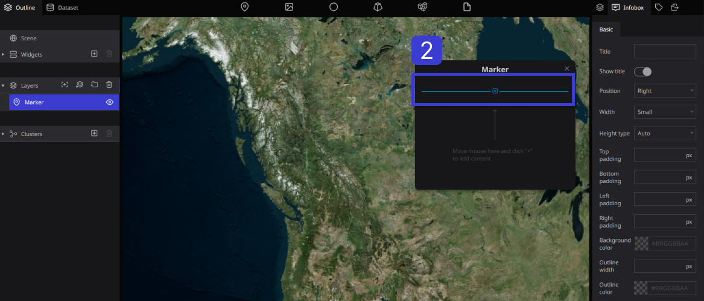
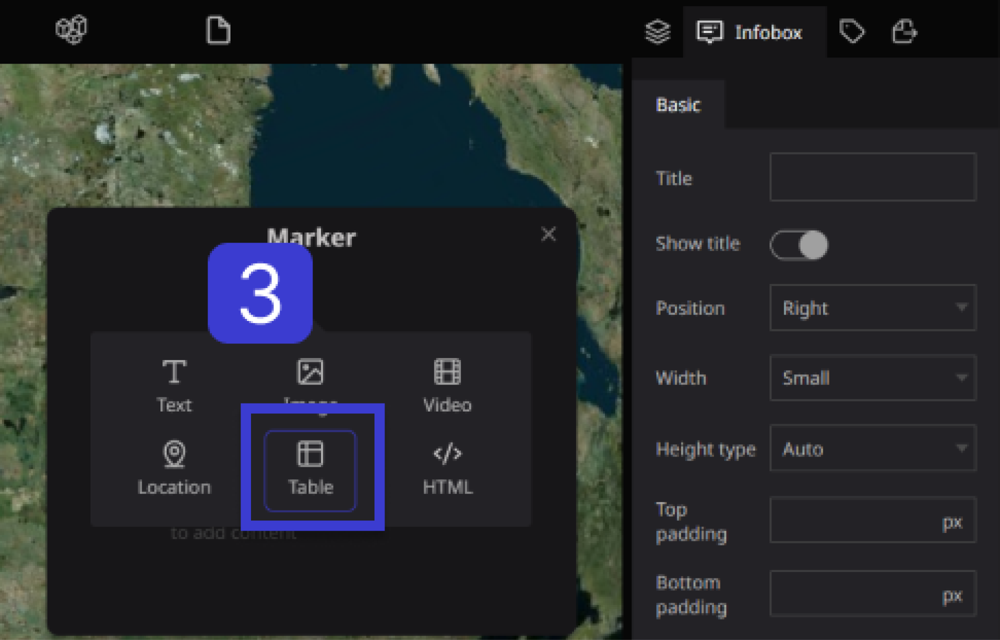
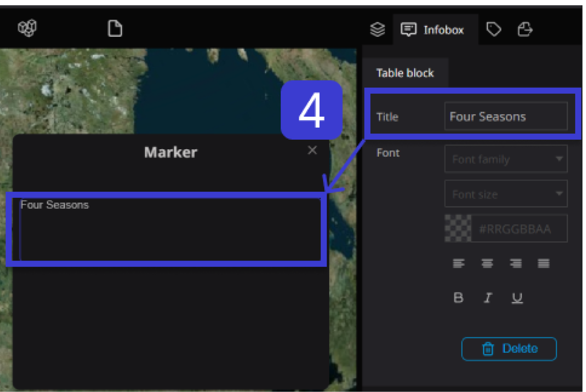
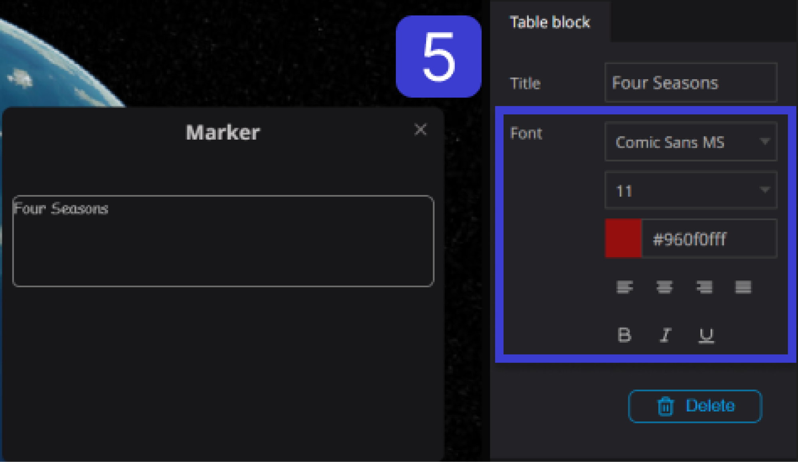
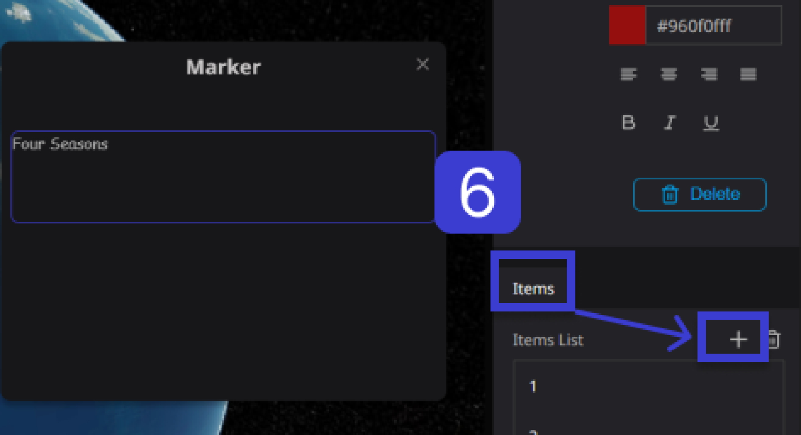
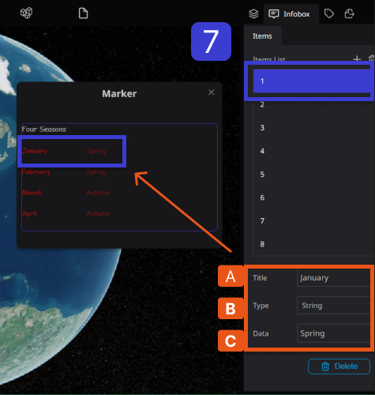

# Table Block

The Table Block allows you to add a table within an Info Box.

**Step1.** Choose the desired layer from the left panel to set the text.

**Step 2.** Select the Info Box tab from the right panel.

**Step 3.** When you place the cursor inside the Infobox, a plus sign (+) will appear. Click on the plus sign and select "Table".

**Step 4.** When you enter text in the title, the title will be displayed in the table block.

**Step 5.** You can set the text font, size, color, alignment, and bold within the font in the list.

**Step 6.** To add a list to the item list, simply click the "+" button located on the right side of the item.

You can add multiple lists by clicking the "+" button for each list you want to add.

7.To create a list table inside an item, first select the relevant list, and then perform the following settings:

A: Enter text in the title. (e.g. January)

B: Select either "String" or "Number" for the type. (e.g. String)

C: Enter data (text). (e.g. Spring)

Then it will be displayed like this.