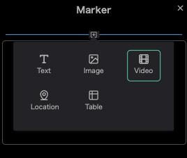
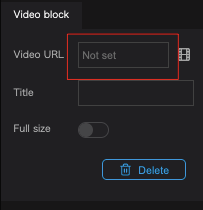

# Video block

The video block allows you to add external videos through a URL.

- Click the `+ button` in the infobox.
- Select the `Video button`.

- Click Video URL from the properties of the video block and enter the video URL.

For obtaining the URL of the video, please refer to the various video services.

(How to get the video link on Youtube can be done from the video page sharing.)

Title allows you to set an optional title for the video.

When Full Size is toggled (green), the video will be maximized to the full width of the infobox.