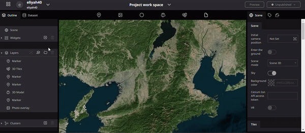

# Create a New infobox

### To create a new infobox in the Re-Earth app, you can follow these steps:

1. Open the **Re-Earth app** on your device and log in to your account.
2. Navigate to the section or feature where you want to add the new infobox. This could be a **Marker, specific project, location, or category.**
3. switch to the infobox tab found on the right panel. Click `Create Infobox` 
4. Click or tap on the add/create button to initiate the process.
5. A form or template will likely appear, prompting you to enter the relevant information for the infobox. This includes **title, description, image, location, date**, ETC. to the type of infobox you're creating.
6. Fill in the required information in each field. Some fields may be optional, depending on your needs.
7. Once you have completed filling out the necessary information, review the details to ensure accuracy and completeness.
8. Click or tap on the "Save" or "Create" button to finalize the creation of the new infobox.
9. The infobox should now be added to the designated section or feature in the Re-Earth app, and it will be visible and accessible to users.

**Illustration of How to create infobox**

### Click the `+` button on the displayed infobox to add a block to the infobox.

In the Re-Earth app, you can choose from the following content formats when adding information to an infobox:

1. Text: This format allows you to add text-based content to the infobox. You can enter descriptions, details, instructions, or any other textual information relevant to the infobox.
2. Image: With the image format, you can include visual content in the infobox. This could be a photograph, illustration, or any other image that provides additional context or enhances the presentation of the information.
3. Video: The video format enables you to embed videos within the infobox. You can add video content from external sources or upload your own videos to enhance the user experience and provide visual explanations or demonstrations.
4. Location: The location format is a map-based block that allows you to pinpoint and display a specific location on a map. This is useful when you want to provide geographical context or highlight a particular place relevant to the infobox.
5. Table: The table format enables you to present structured data in a tabular form. You can create columns and rows to organize and display information in a clear and organized manner.

When adding content to your infobox, consider the nature of the information you want to convey and select the appropriate format from the above options. You can mix and match these formats within the same infobox to create a rich and engaging user experience.

 