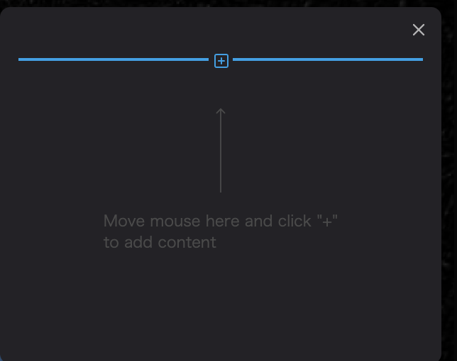

To create an infobox, switch to the infobox tab found on the right panel.
Click `Create Infobox` to add an infobox to the selected layer.

Click the `+` button on the displayed infobox to add a block to the infobox.

Please select the appropriate content format from the following:

Text: Text-based block

Image: Image-based block

Video: Video-based block

Location: Map-based block

Table: Table-based block