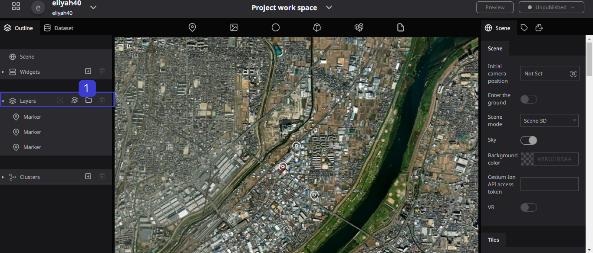
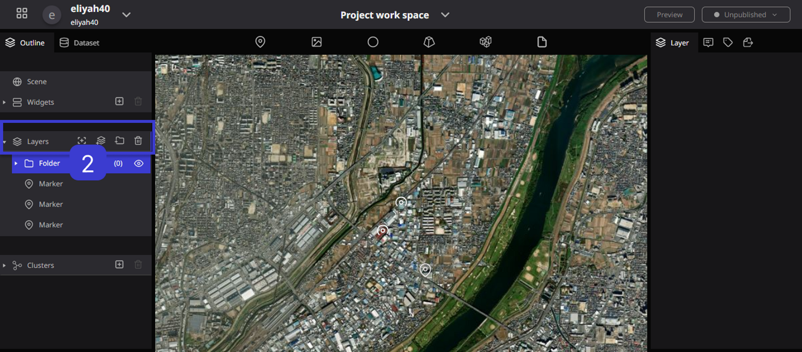
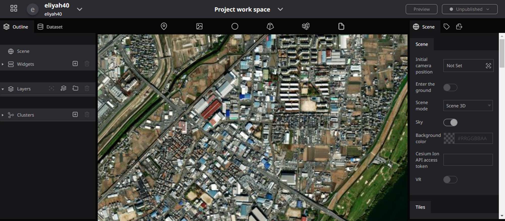
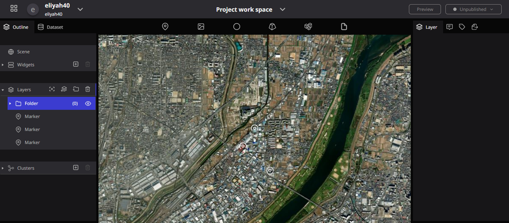
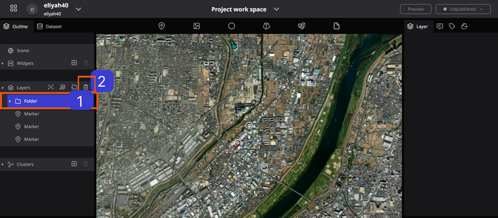
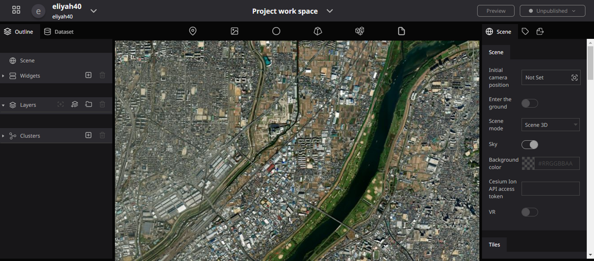

# Create, Delete, and Update layers

## Create layers

To create a layer, click to move the box icon.

### Before creating a Layer

Then the Layer folder will be created

### After Creating a Layer

### Creating Layer illustration

## Changing Layer Properties

When you select a layer, you have the power to change its properties and transform its appearance. This means you can easily modify its state, shape, and other attributes to achieve the desired effect. Below are a few examples showcasing what you can achieve with layer properties.

### Changing the position

After clicking on the layer, hover the mouse over the icon on the globe, and hold down the left-click for more than one second until it changes to a hand shape. While in this state, you can drag and drop to move the position.

### \***\*Changing the Appearance\*\***

You can change the style, size, color, and other attributes of this marker layer.

### Adding Labels

You can also add labels to the marker layer and adjust the font type for customization.

For marker layers, there are various customizable items available. You can find more information **[here](./reearth-layers/marker/marker.md)**. Each layer type has different parameters and functionalities, allowing for detailed settings in the layer properties.

By adjusting the settings of other layers, you can achieve different effects and outcomes.

## Delete layers

**Steps to Delete Layers**

To **Delete** a Layer, Click on the Layer folder, then click on **Delete,** and the Layer will be Deleted.

### Deleting Layer illustration

## Update layers

This is a process by which you can update some information in the Layer.

Layers update can be done by double-clicking the Folder. u can double-click to change the layer folder name, you can drag to move the marker inside the layer folder. you can change the Folder position.

### Updating Layers illustration

**Before updating Layer Folder After updating Layer Folder**

