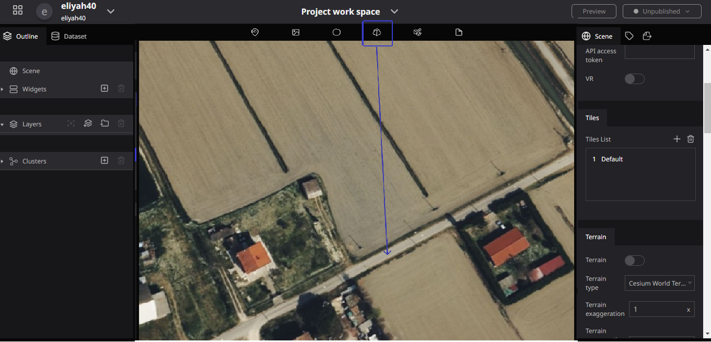
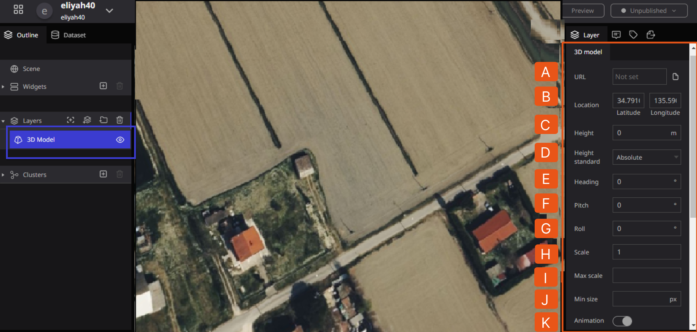
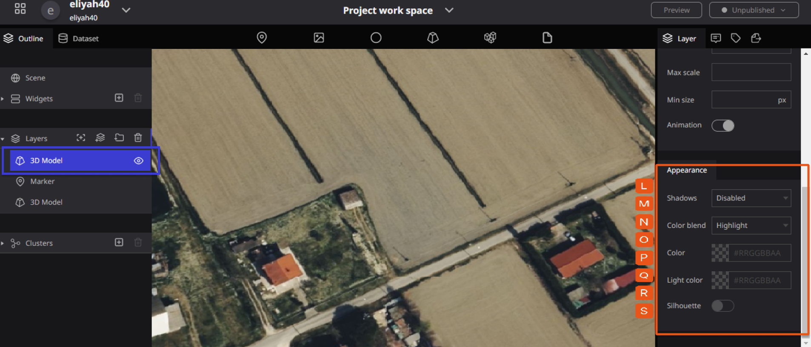
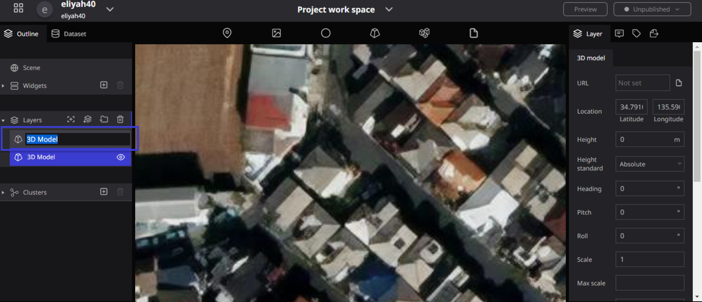
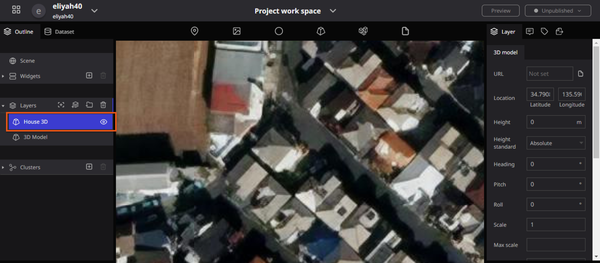
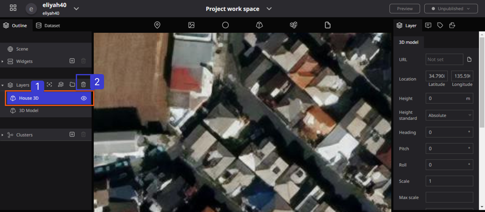

# 3D Model

This tool is for placing your 3D model data on the Re-Earth App.

### Supported Data Formats

- glTF

The 3D Model Supports glTF 1.0 or 2.0 and also supports Draco compression.

There are various glTF formats, but glTF Embedded (`.gltf`) or glTF Binary (`.glb`) format is mainly supported, in which all data including images are embedded in a single file.

The glTF Separated (`.gltf` + `.bin` + image file, etc.) format, split into multiple files, is not supported for upload and display in The Re: Earth App. 

However, if you directly specify a file URL distributed on a server with appropriate CORS settings, you may be able to display the file.

Other formats (e.g. `.obj` `.fbx`) are not supported. Please convert the file to glTF format by yourself beforehand.

### How to place your 3D model in the Re’Earth App

1. drag and drop a marker on the 3D model to the desired position.

At this point, no markers or icons will be displayed.

1. When the "3D Model" item is newly added to the layer list on the left and a blue band is attached, the 3D model layer setting screen opens on the right.

A. **URL**: This is where you can enter the URL of the uploaded **3D model** data to display it.

- Clicking on the URL input field will display the asset modal. You can upload and select 3D models from here. See Asset Modal for details.

B. **Location**: In the Location section you can Set the latitude and longitude to display the 3D model.

C. **Altitude**: At the Altitude, you can set the height at which the 3D model will be displayed.

D. **Altitude Base**: You can select from "Default", "Fixed to the ground surface", or "Altitude from the ground surface". When "Default" is selected, the altitude is the absolute altitude from the WGS84 ellipsoid (digital earth). Fixed to Surface" and "Elevation from Surface" will be different from "Default" only if the "Terrain" setting is enabled in the scene.

E. **Heading:** This ****Specifies the horizontal angle of the 3D model. The valid range is 0~360.

F. **Pitch**: The Pitch Specify the vertical angle of the 3D model. The Valid range is 0~360.

G. **Roll**: Specifies the tilt angle of the 3D model. The valid range is 0~360.

H. **Scale**: Specify the display size of the 3D model data in equal size.

I. **Max Scale**: The Max Scale is the Maximum scale displayed on the screen. The unit is the same as the "Size" setting. No larger than this will be displayed.

J. **Minimum display size**: Minimum size to be displayed on the screen. The unit is a pixel. It will not display any smaller size regard than the pixel.

K. **Animation**: Turn on/off the animation included in the 3D model data. Note that if you want to enable animation, you must also enable animation in the scene settings.

L. **3D Model Shadows**: Turn on/off shadows on the 3D model. Note that if you want to use the 3D Model Shadows, you must also enable them in the scene settings.

M. **Color Blend**: Allows you to tint the 3D model with a specified color. You can select "Disable", "Highlight", "Replace", and "Mix". 

When "Disable" is selected, no color blending is performed. Highlight" multiplies the intrinsic color of the 3D model by the color you set. Replace" replaces the intrinsic color of the 3D model itself with the color you set. Mix" blends the intrinsic color of the 3D model with the color you set.

N. **Color**: Sets the color of the 3D model, HTML color codes are valid.

O. **Color Mix**: Specify the amount of color mixing. The valid range is 0~1. Valid only when "Mixed" is selected for color blending.

P. **Lighting Color**: Specify the lighting color of the 3D model.

Q. **Silhouette**: display the outline of the 3D model.

R. **Silhouette Color**: specify the outline color of the 3D model, HTML color code is valid.

S. **Silhouette size**: set the width of the outline of the 3D model. Unit is the pixel.

### Renaming a 3D model

To rename a 3D Model, Double-click on the word "3D Model" in the layer to rename it.

### Renaming a 3D Model Illustration

Before Renaming a 3D Model

After Renaming a 3D Model

### Deleting a 3D model

To Delete a **3D Model**, Click on the 3D model(3D name) you wish to delete in the layer on the left panel, make sure it is selected in blue, then click the "trash can" symbol to delete it.

### Deleting a 3D Model Illustration

