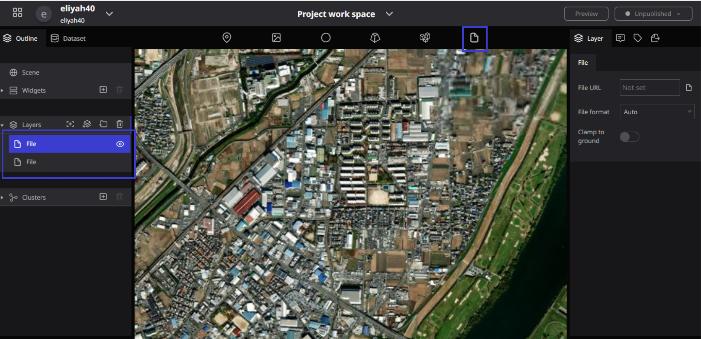
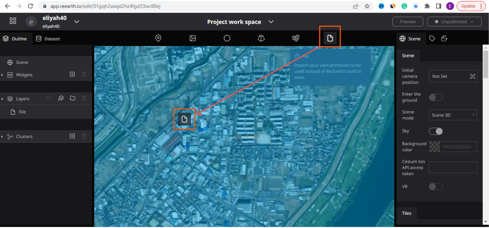
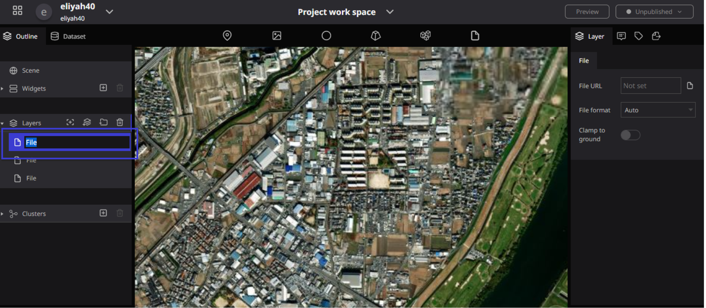
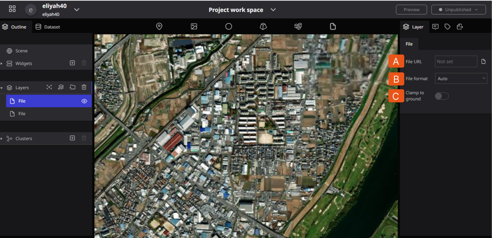
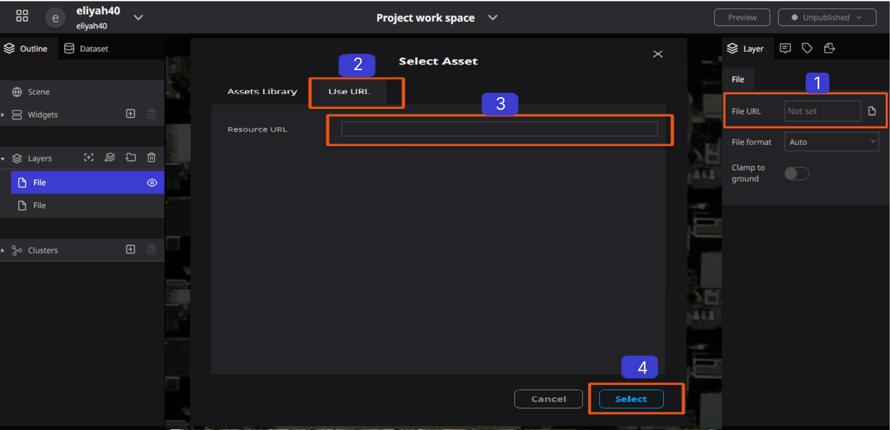

# File

## What is a file?

A file, is a place (a document) in a cabinet, box, or folder in a particular order. A file is also know as a folder or box for holding loose papers together and in order for easy reference.

In the Re-Earth App You can import files from outside. Also, an External data can be imported by specifying a URL.

## How to use files

### Adding a file

- In the Re-Earth globe, drag and drop the file icon to the desired location. (No symbol will appear at the time of drag and drop.)

When a file is dropped into the Re-Earth globe, the word "file" appears in blue in the layer on the left panel. 

This is the file that was dropped  in the Re-Earth globe. Also, as you drop More file icons, the more 3D tiles will appear in the layer.

### Renaming a file

Double-click on the letter of the file you want to rename in the layer, and you will be able to rename it.

### Hiding files

Click on the eye symbol on the right side of the file in the left panel to make the 3D part on the globe disappear.

### Deleting a file

To delete a file, click on the file you wish to delete in the layers in the left panel, make sure it is selected in blue, and then press the "trash can" symbol on the right side of the layer to delete it.

## File Properties

File Properties are as follows: (A) File URL, (B)File Format(Which has the following types: Auto, KML, GeoJSON/TopoJSON, and CZML), and Finally (C) Clamp to ground

**File properties allow you to set the following items**

**A. File URL:** File data can be uploaded by specifying a file URL.

1. click on the URL input field to display the SET modal. 
2. select the URL tab in the SET modal.
3. You can enter a URL. 
4. Click the Select button in the lower right corner.

**B. File format:** Select file format from (**Auto, KML, GeoJSON/TopoJSON, or CZML)**.

**C. Fixed to ground** surface: If ON, polygons and other data can be displayed along the unevenness of the ground surface.