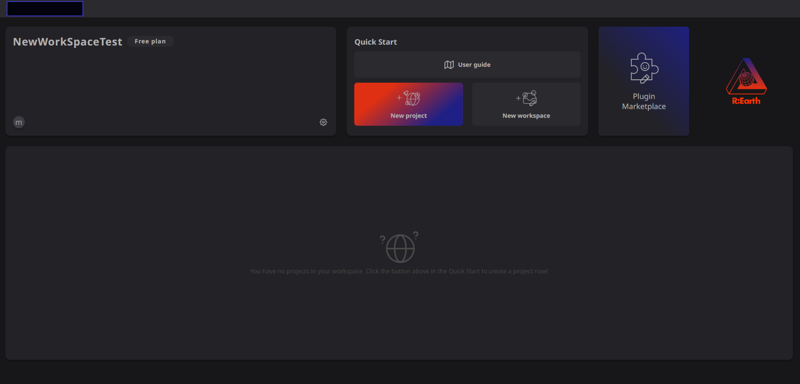
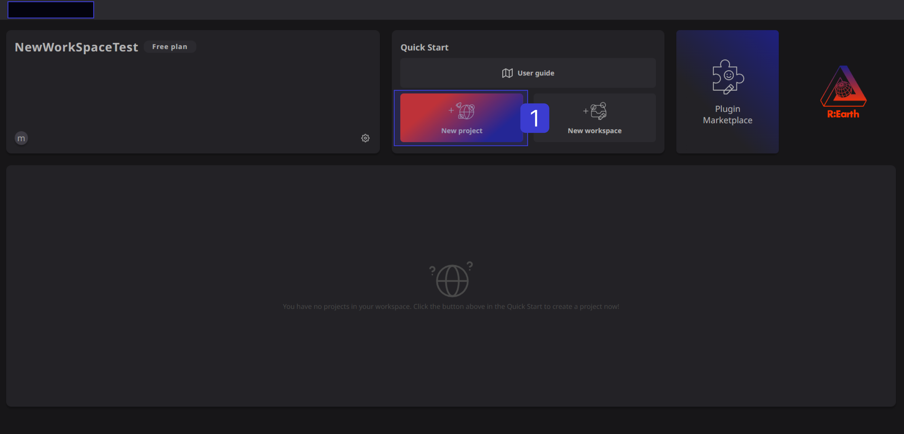
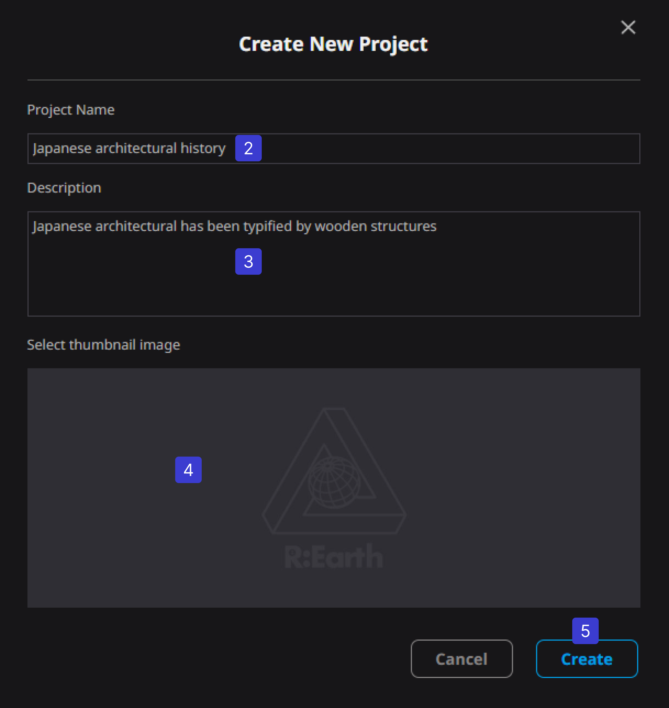
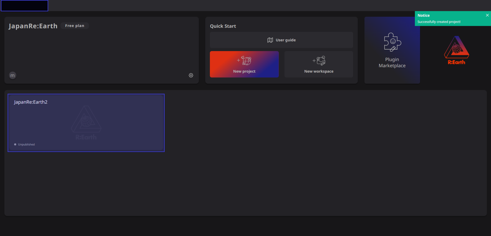
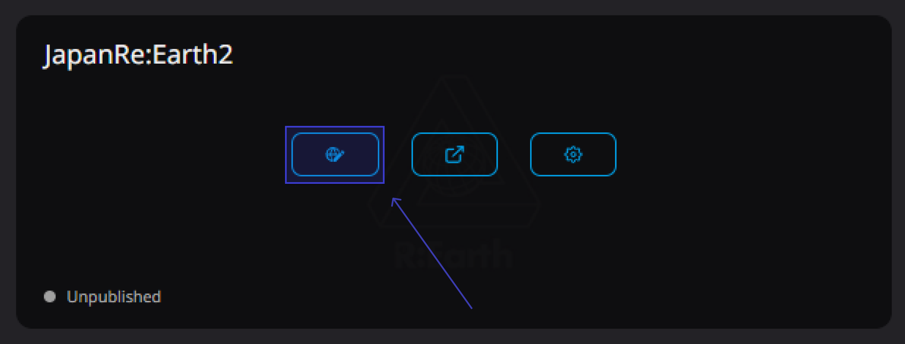

# ****Create a New Project****

Creating a project is easy and you'll be ready to go in no time.

When you log in to Re: Earth, you will see a page called Dashboard. From this screen you can create a new project.

(1) Click the [New Project] button 

A window titled Create New Project will appear.

② Enter the project name

③ Fill in the project outline

④ Select a thumbnail image

⑤ Click the [Create] button

Once complete, you'll see a new project card in your project list.

You've just created your first Re:Earth project! You can move to the edit screen of the created project by clicking the edit button on the project card here.

