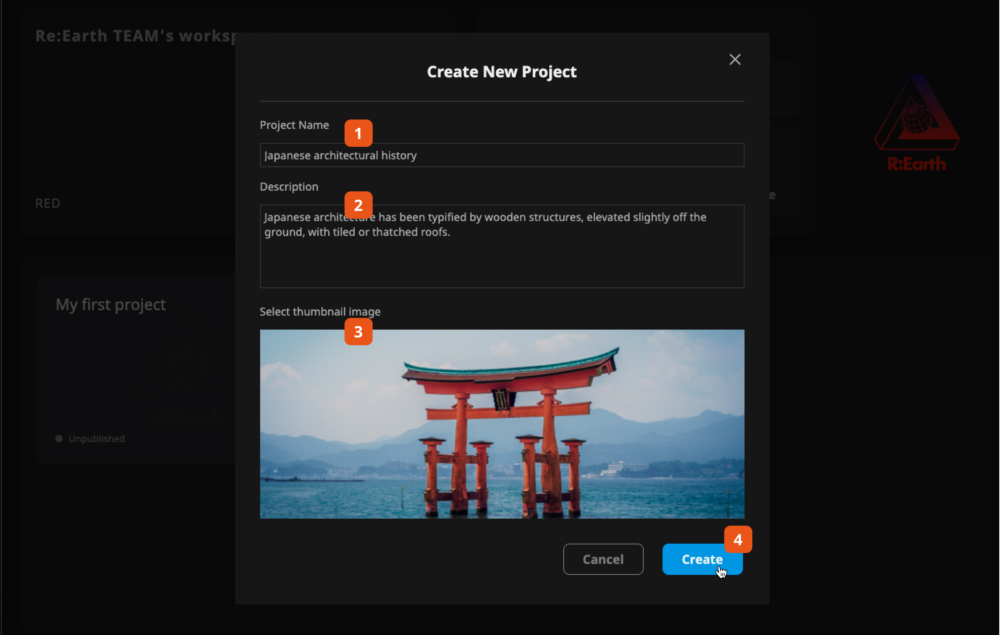

There are two ways to create a new project in Re:Earth.

### From Dashboard

  Dashboard —> Quick Start —> `New project button` —> Fill modal

  

### From editor page

  Editor —> Header menu —> `Manage projects` —> Project list page —> `New project` —> Fill modal

  

  

### Create new project modal

The last step of creating a new project is to fill in the initial information of the project, you will see the following modal form.

<!-- 

  1
  <strong>Project Name</strong> is the place where you can write the name of your project.

  2
  <strong>Description</strong> is the place where you can write the introduction of your project, in order to facilitate management when the number of projects is large.

  3
  <strong>Thumbnail image</strong> will be used inside the platform as the main visual image of your project.

  4
  After completing the steps above 👆, click the Create button.

 -->
1. **Project Name** is the place where you can write the name of your project.
2. **Description** is the place where you can write the introduction of your project, in order to facilitate management when the number of projects is large.
3. **Thumbnail image** will be used inside the platform as the main visual image of your project.
4. After completing the steps above 👆, click the Create button.

:::caution

Now these project settings will only be displayed inside Re:Earth. When publishing the project, we can specifically set the project information and OGP for publishing. For more information about the public setting, please check [here](/user-manual/project-and-workspace/project/public-setting)

:::

