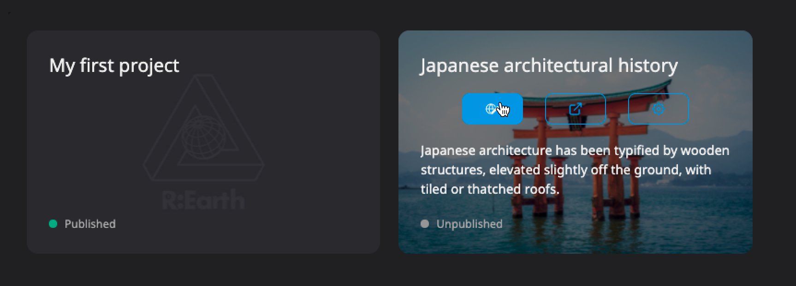
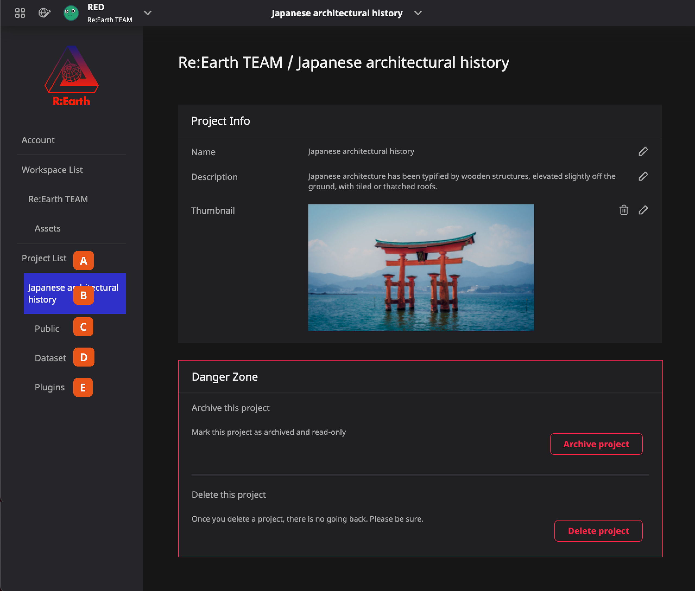

Project is your main editing part in Re:Earth.

Open the project you created, enter the edit page, and by default you will see earth floating in the universe. This is because when any project is created, a [Cesium scene](/user-manual/scene/ideas-of-scene) will also be created at the same time. For more information about scenes, please see the chapter on [scenes](/user-manual/scene/ideas-of-scene).

You can add and build various content on the earth, as described in the previous chapters. The project is like a canvas in which you can create, but in the Re:Earth project, the earth itself is the canvas.

A project can have the following operations:

- [Create](/user-manual/project-and-workspace/project/create-a-new-project)
- Preview
- Publish
- [Archive](/user-manual/project-and-workspace/project/setting-archiving-and-deleting)
- [Delete](/user-manual/project-and-workspace/project/setting-archiving-and-deleting)

## Enter project setting page

Each project has a page to modify its own parameters, and there are two ways to enter:

### From Dashboard

Dashboard —> Project card —> ⚙️  button

  

### On the editor page

Header —> Project menu —> Project settings

  

## Project setting page

The Project setting page provides a series of management of the project itself and the materials used (Dataset, Plugins).

1. **Project list page** will display all the projects under the current workspace, you can continue to return to this page to switch between different projects
2. **Current project page** you can modify the basic information of the project on this page, and archive or delete the project. For details, please check the Setting, archiving, and deleting
3. **Publish settings page** provide some settings about publishing your project, please check Public Setting for details
4. **Dataset library page** used to manage the Datasets of the current project. For details, please see Dataset library and the Dataset chapter
5. **Plugin Library page** used to manage the plugins of the current project, please see Plugin Library and the Plugin chapter for details

## Public status

When you finish a project, you can publish it on the Internet. We have provided some signs to keep you informed of the public status of the project at any time.

- On the project card of the Dashboard, you can check the status.
    
    
    
- In the upper right corner of the Editor page, you can also check and change the status at any time.
    
    
    
## Cooperate

In order to support collaborative editing between team members, we have developed a workspace system. Members in the same workspace can participate in editing the same project. For specific operations, please refer to the chapter on the [workspace](/user-manual/project-and-workspace/workspace/ideas-of-workspace).