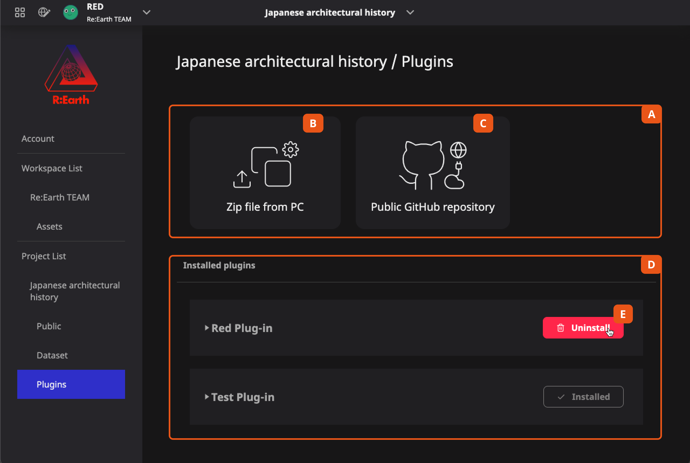

One of the biggest features of Re:Earth is the plug-in system. Users can expand their functions by developing their own plug-ins, or using plug-ins developed by other users in the community. For specific explanations, please see the dedicated [Plugin chapter].

The Plugin Library page is used to install, remove and manage plugins.

:::caution
Now the plug-in system is being tested and developed closely, and the UI interface and usage method may also be changed
:::

A: Here is the part to install Plugin

B: Zip file from PC button allows you to upload the plug-in from the local installation to the system

C: Public Github Repository button allows you to install the plugin to the system from Github

Please see [Installing the plugin] for the detailed process.

D: The Installed plugins list shows all the installed plugins of the current project

E: Mouse hover here, click the Uninstall button to remove the plugin