# Overview

## Scene

You can modify settings related to the entire project and the Digital Earth background in the scene.

This section explains how to locate the scene. 

I**n the scene, there are Nine Boxes that you can manipulate :**

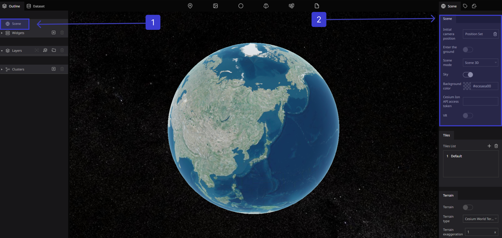

Scene allows you to experience geographic information similarly to the way you would in the real world.

This helps you to understand large and complex data and its spatial relationships by representing it as real-world objects that can be visualized, analyzed and managed in a scene.

## **Here we can set the basic information for the scene**

### Set the initial camera position

In Re-Earth the default setting is to display all of North America. You can change the camera position to be displayed on the page load by setting the initial camera position.
and Click on (not set)

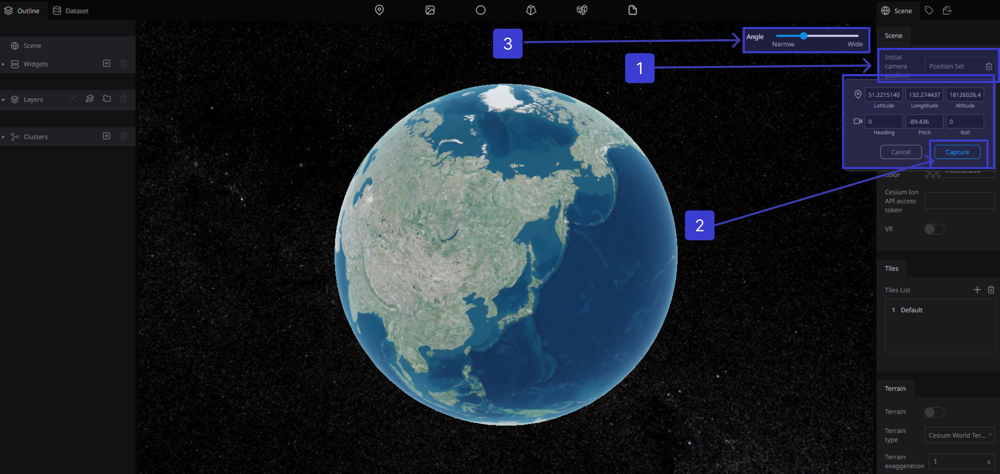

Move the digital earth to the desired location. Click (Capture) to add the coordinates that you want

### **Enter the ground**

Set the true to allow the camera to enter the surface of the earth by clicking on The Enter the ground toggle on/off on allow / off not allow

### Scene mode

In Scene mode, we get three options are different viewing modes you can use to visualize 3D data

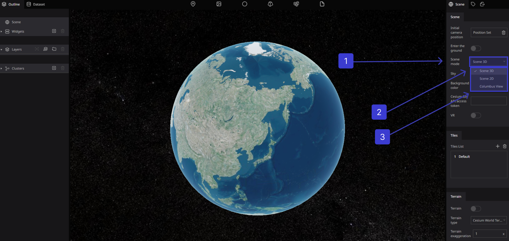

### Scene 3D

3D mode. A traditional 3D perspective view of the globe.
Working in 3D can incorporate real-world elements with your content, highlighting influences such as the movement of the terrain and the 3D extent of features such as trees, buildings, and subsurface geology.

### Scene 2D

2D mode. The map is viewed top-down with an orthographic projection
This option can acquire high-quality 2D images at various angles of the place the paper focuses on. Identifying the feature points from a 2D image acquired from the calibrated camera and reconstructing those features using depth analysis to obtain the 3D view of the object or image

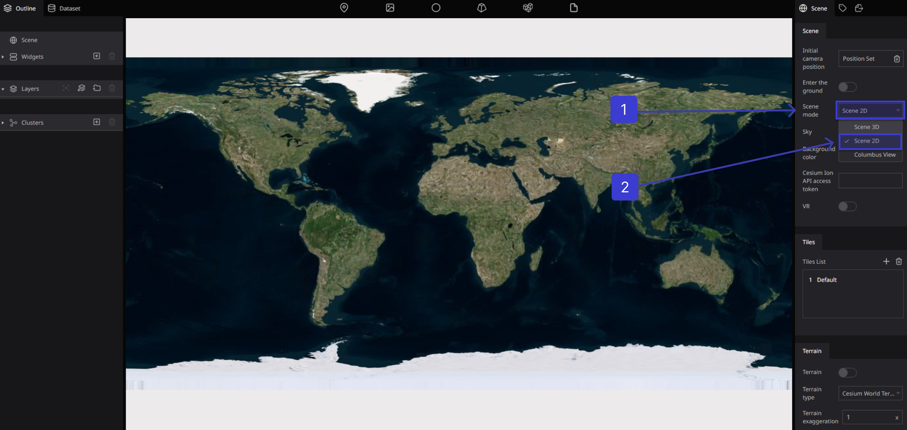

### Columbus View

Columbus View mode. A 2.5D perspective view where the map is laid out flat and objects with nonzero height are drawn above it.

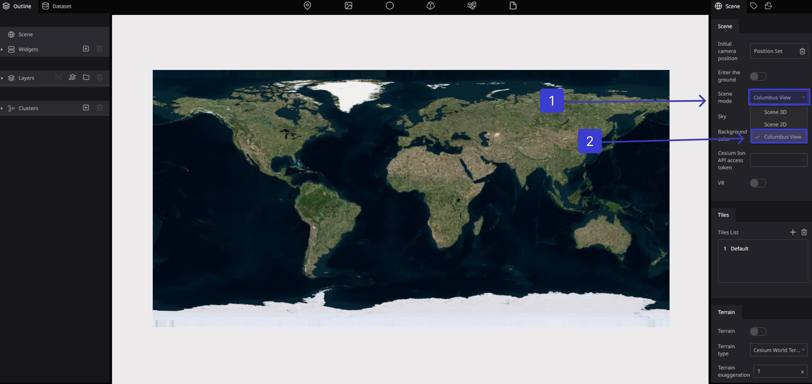

### Sky

The Sky toggle enables using space as the background.

Click the (Sky) toggle Such as (on) enabled the Sky and  Stars 

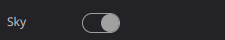

Click the (Sky) toggle Such as (off) disabled the Sky and  Stars

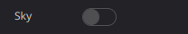

### Background color

Set background color

Disable the Sky and Click (not set) for the background color.

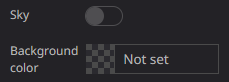

With the background color setting, you can set the background color seen if the sky is not enabled.

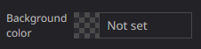

Select any color from the displayed color panel and click Save

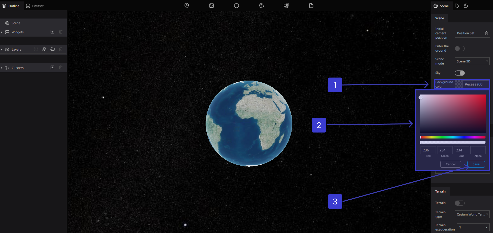

the background color will be changed immediately

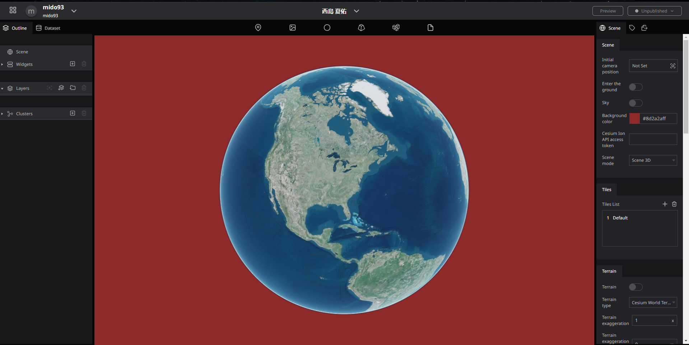

Before Setting the Color 

After Setting the Color 

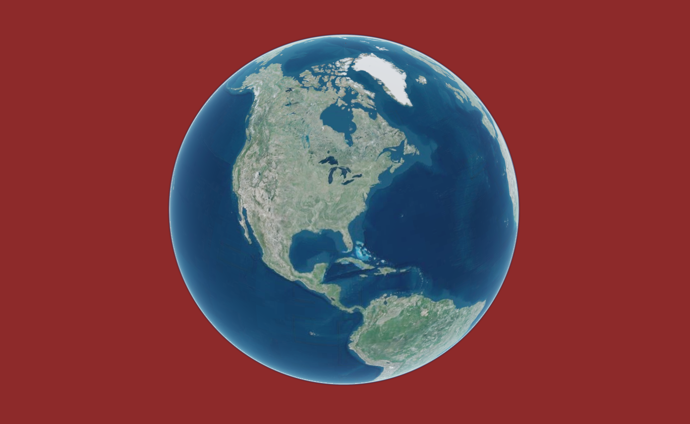

### Cesium Ion API access token

Access tokens provide authentication when using Cesium ion’s REST API and are used to link API requests to your account. Access tokens allow you to integrate ion into your workflows and apps, including things like automating asset uploads and accessing your assets. 

This guide provides information about how to create and manage access tokens, and best practices to ensure account security.

The Cesium ion API access token enables the use of Cesium ion assets (map tile data, 3D data, etc.).

To do so, register with Cesium Ion and set the API key issued by your Cesium Ion account to your project.

### VR

Enable VR mode to split the screen info left and right

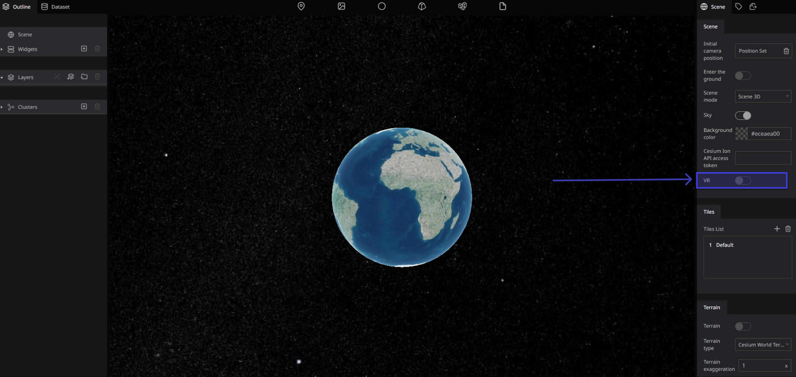

Enable the toggle

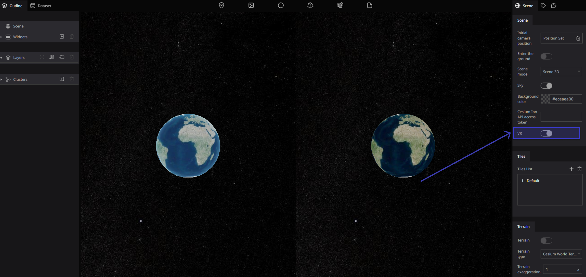

Disable the toggle

