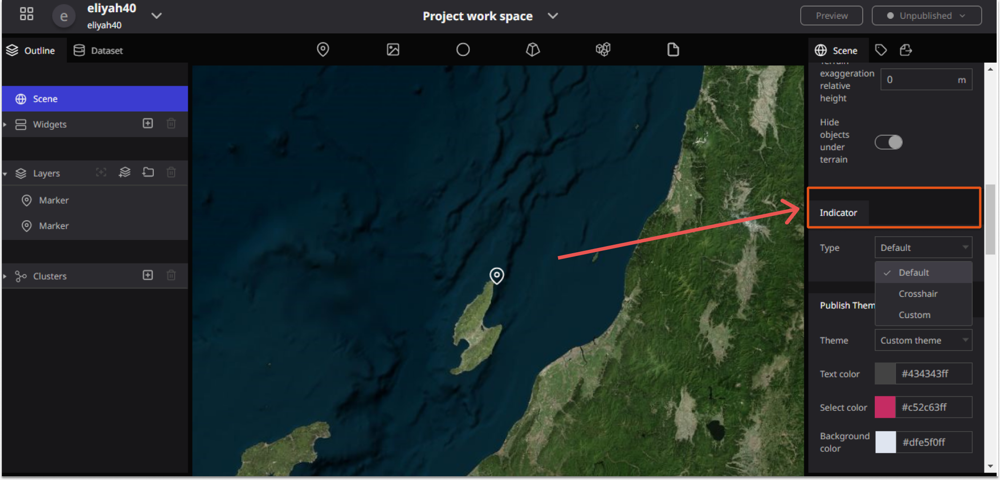

# Indicator

The indicator is used to indicate a particular object in the Re-Earth app.

You can also change the selecting indicator on the editor page. The re-Earth app also supports customizing the indicator by uploading your own image.

### Types Of Indicators in the Re-Earth Workspace

**The Indicator contains** three types which are; **Default, Crosshair, and Custom.**

**(A)Default**

***The Default*** is the first type of Indicator in the Re-Earth app. The Re-Earth app was designed in this Mood.

                                           Diagram of the Default Indicator

**(B) Crosshair**

It’s the second type of Indicator in the workspace Re-Earth app. Crosshair indicators are thin vertical and horizontal lines centered on a data point in a chart. Click on Crosshair to enable crosshair indicator in your charts, Crosshair Indicator is used to target a single element.

                                    *Diagram of Crosshair Indicator*

**(C)Custom**

***Custom*** is the third type of Indicator in the Re-earth app workspace.
In Custom you can customers your own personal Indicator as an IMAGE or any diagram.

You can also choose your Image scale in the IMAGE SCALE filed

**Image**

In the Image field, you can set your choice of image.

**IMAGE FILED Component:**

**(A) Assets Library:**

In the **Assets Library**, you have the option to select and upload the Image from your computer.

Step to select and upload your image to the Re-Earth Map.

**(B) Use URL**

You can Upload your Image using a URL.

**(C)IMAGE SCALE**

The **Image scale** box allows you to input the size of your Image in the Re-Earth App. With this function, you can select and change the size of your image.

