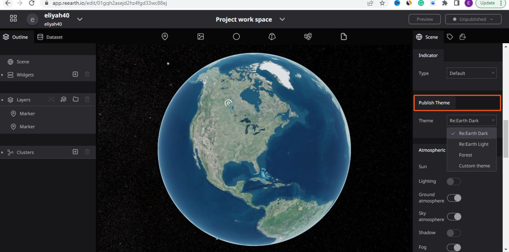
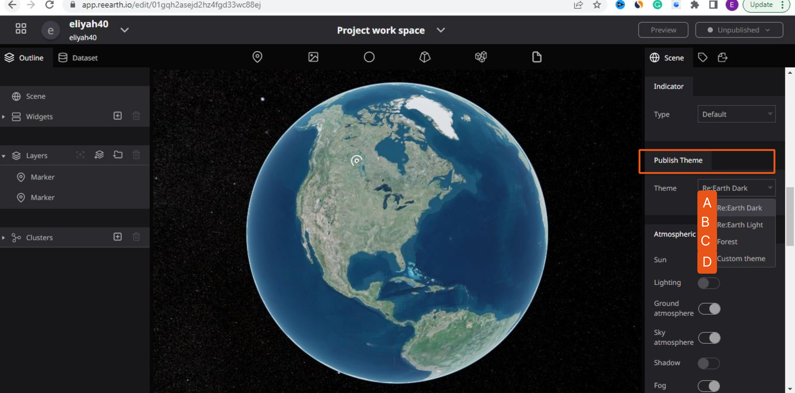
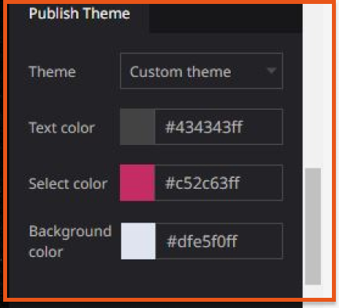
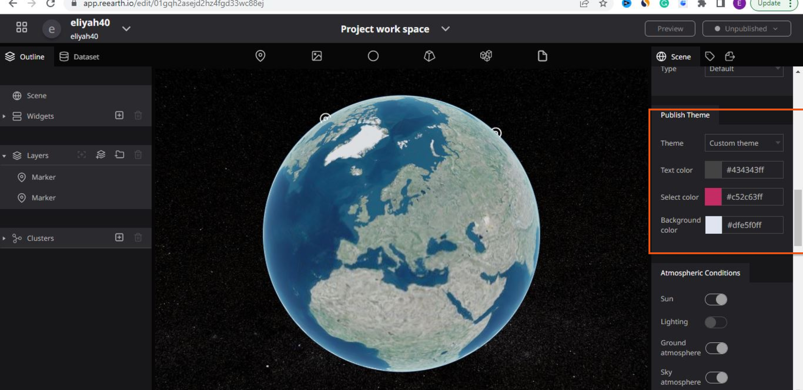

# Publish Theme

# **Publish Theme manual**

With Publish Theme, you can choose from different themes designed to suit your needs.

Selecting a publish Theme lets you change the look of your project in the Re-Earth app. 

The difficult theme for the Re-Earth app is the ReEarth Dark Theme

**Overview**

                               Overview Diagram of the Publish Theme

# Types Of Publish Theme

A. Re: Earth Dark Theme

B. Re: Earth Light Theme

C. Forest Theme

D. Custom Theme

### A. **Re: Earth Dark Theme:**

The Re: Earth Dark Theme is the first type of theme in the Re-earth App. it is a difficult theme for Re-earth. Discover a new way to experience the world with Earth Dark Theme.

Enjoy a beautiful, immersive dark mode that's optimized for low-light settings, with enhanced color contrast and improved readability. With Earth Dark Theme, you can explore the world in a whole new light - without sacrificing comfort or convenience! Our revolutionary theme for the Re-Earth App gives you the power to customize your experience and make your device more eco-friendly.

### B. Re: Earth Light Theme:

The Re: Earth Light Theme is the second type of Theme in the Re-earth App. This Theme displays a beautiful light theme color.

### **C. Forest Theme:**

The Re: Earth Forest Theme is the third type of Theme in the Re-earth App. This Theme gives green beautiful earth in the Re-earth App. 

### D. Custom Theme:

In the Custom Theme, you can Customize the Re-earth app Theme to your own tasty, It gives you different functions to select from, Such as Text color, Select color, and Background color 

                                                         Diagram of Custom Theme

 

 