# Tiles

We can change the  Map shape by tiles system. 

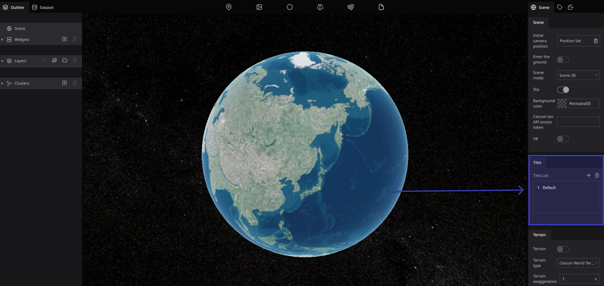

### **What is tiles?**

There are several advantages to tiled maps. Each time the user pans, most of the tiles are still relevant, and can be kept displayed, while new tiles are fetched. This greatly improves the user experience, compared to fetching a single map image for the whole viewport. It also allows individual tiles to be pre-computed, a task easy to parallelize. Also, displaying rendered images served from a web server is less computationally demanding than rendering images in the browser, a benefit over technologies such as Web Feature Service (WFS). While many map tiles are in raster format (a bitmap file such as PNG or JPG), the number of suppliers of vector tiles is growing. Vector tiles are rendered by the client browser, which can thus add a custom style to the map. Vector map tiles may also be rotated separately from any text overlay so that the text remains readable.

### Re:Earth tiles list

The Tiles settings is comprised of a Tile List that shows all the map tiles to be displayed on the Digital Earth and settings for the currently selected tile. You can choose from several existing map tiles, or you can apply externally distributed map tiles by specifying a URL.

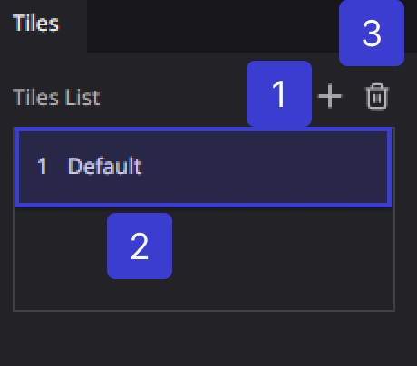

Click on Plus Button ：Adds a tile.

Click on Trash Button ：Deletes a tile.

### Tile type

Selects the tile type of the selected item. 

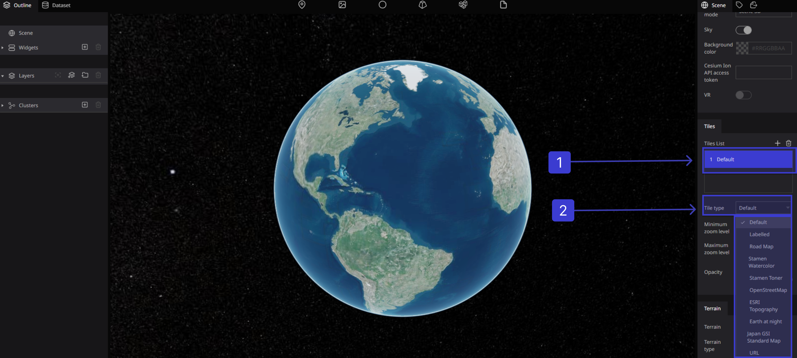

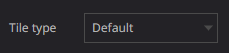

## Tile Types

### **Default**

.png)

### **Labelled**

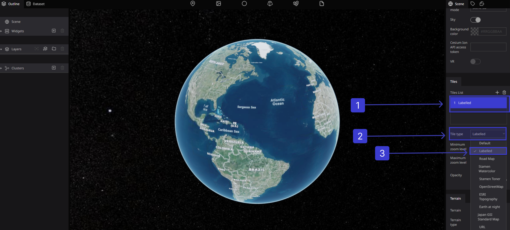

### **Road Map**

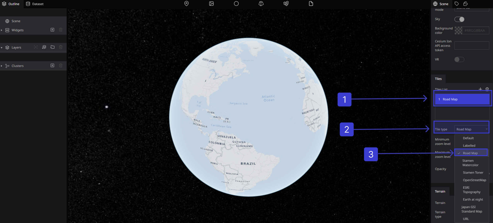

### **Stamen Watercolor**

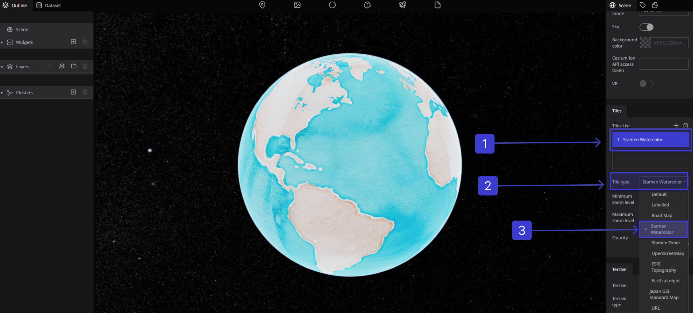

### Stamen Toner

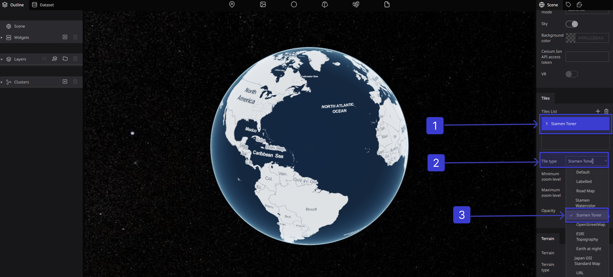

### OpenStreetMap

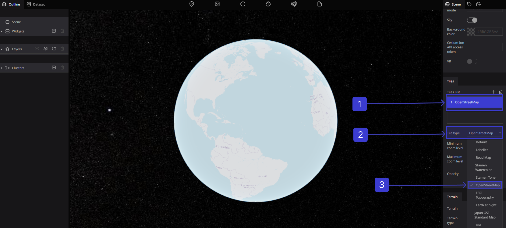

### ESRI Topography

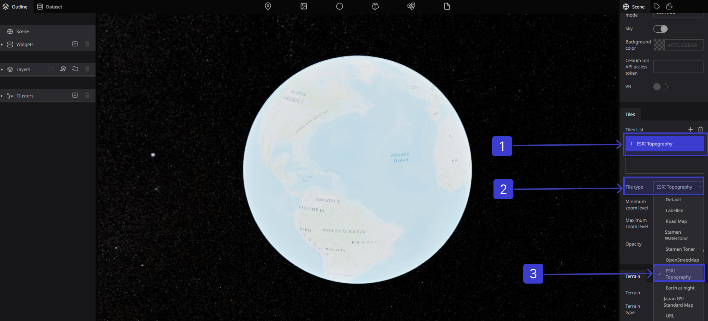

### Earth at night

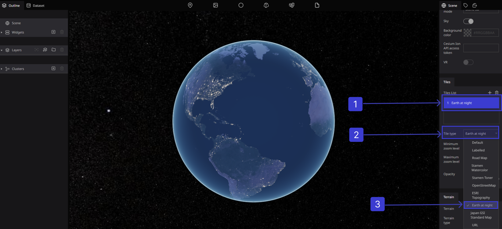

### Japan GSI Standard Map

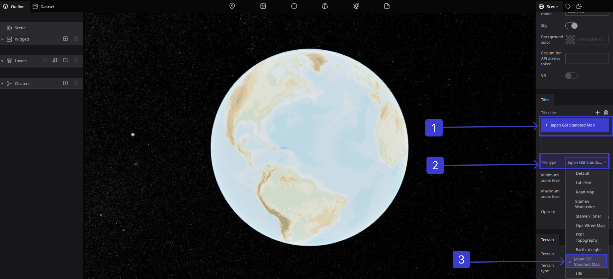

### Using your own Tiles

you can apply externally distributed map tiles by specifying a URL

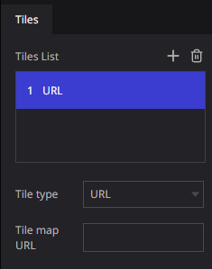

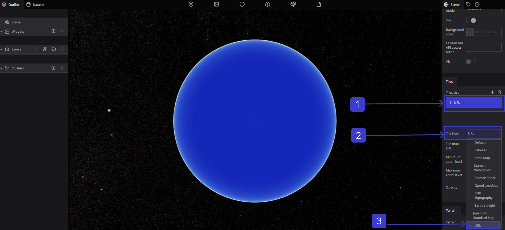

### Tiles Setting

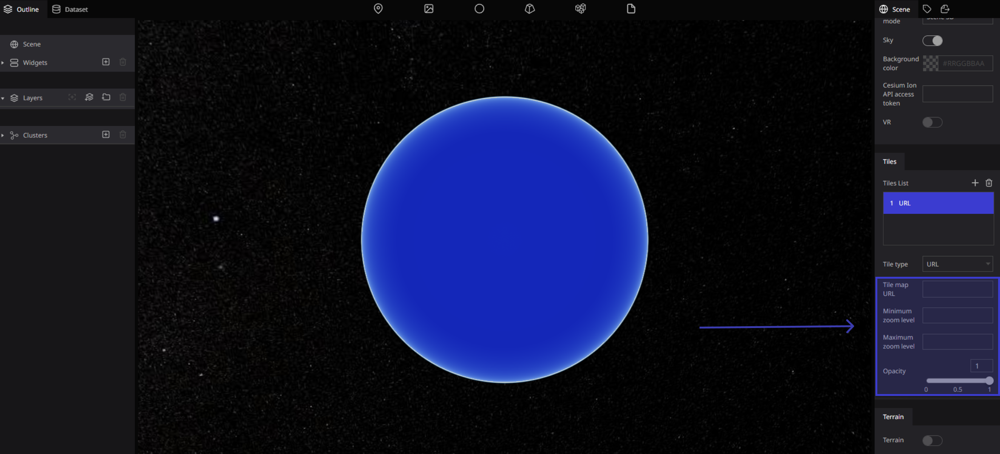

### Zoom level

Minimum zoom level ：Sets the minimum zoom level for the tile data to be display.

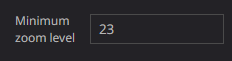

 Maximum zoom level ：Sets the maximum zoom level for the tile data to be display.

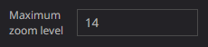

### Opacity

Provides the ability to change transparency of Earth

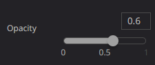