# Timeline

### what is Timeline?

The Timeline view is the main view used when adjusting the timing of drawings, adding keyframes, and ordering layers. The Timeline view displays layers, effects,  keyframe values, scene length, layer names, drawings, keyframes, timing, Ranges, and frames.

### Here you can customize settings related to the timeline :

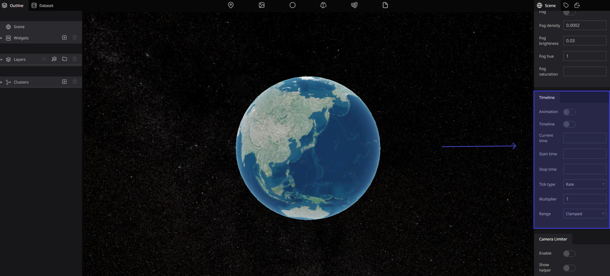

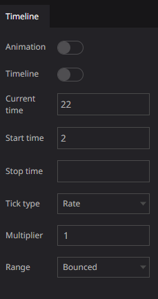

### Animation

To set your animation timing, you will mostly work with the Timeline  views. It's extremely useful to become familiar with the Timeline view, how it works, and its interface.

Enables animation play . if enabled, each 3D models can animate

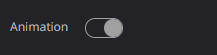

### Timeline

The Timeline view allows you to read your timing from left to right. It represents the scenes elements in their simplest form. You can also see the layers and their names

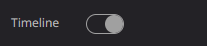

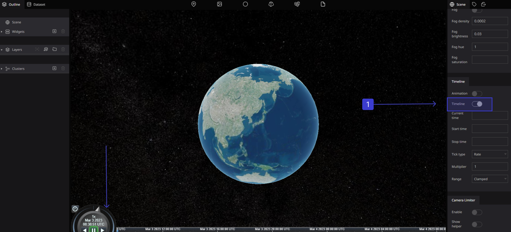

### Current time

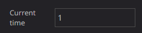

### Start time

if nothing is set, it will be set automatically according to the data being displayed 

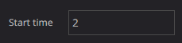

### Stop time

if nothing is set, it will be set automatically according to the data being displayed

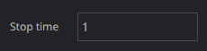

### Tick type

how to specify the playback speed

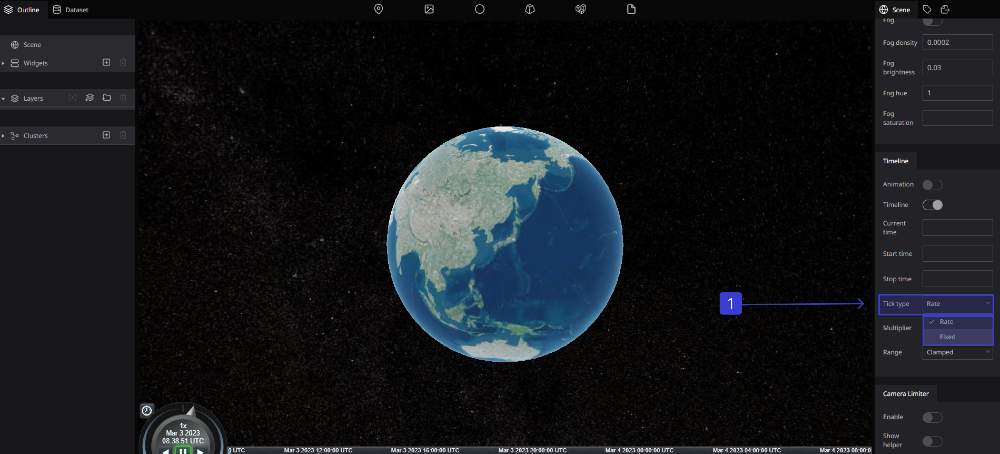

### Multiplier

Specifies the playback speed in seconds . as a multiple of the real time speed.

Negative values can also be specified. Default is 1x.

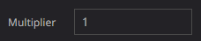

### **Range**

Specifies the playback speed in seconds. Negative values can also be specified

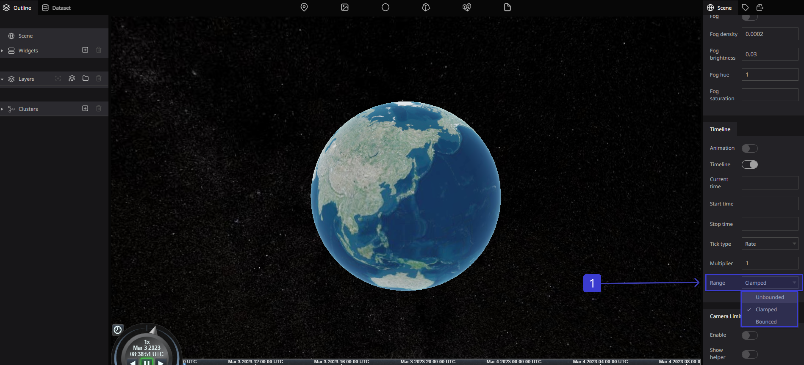