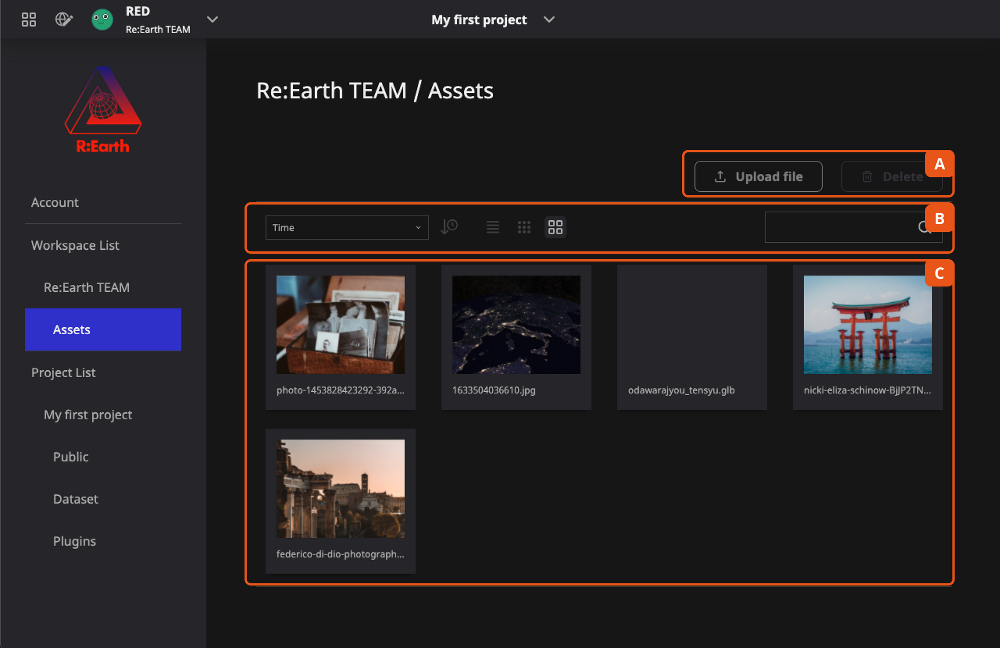
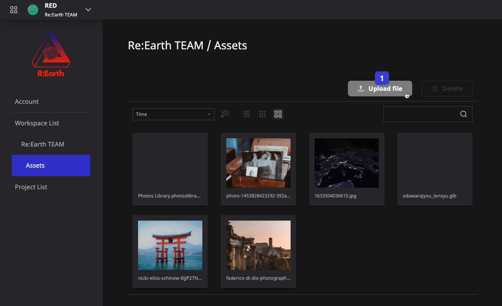
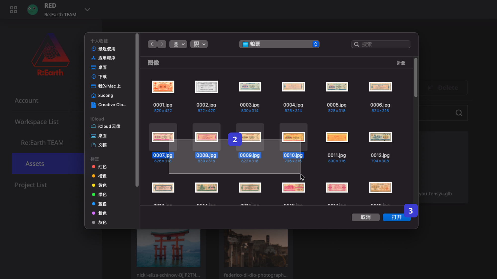
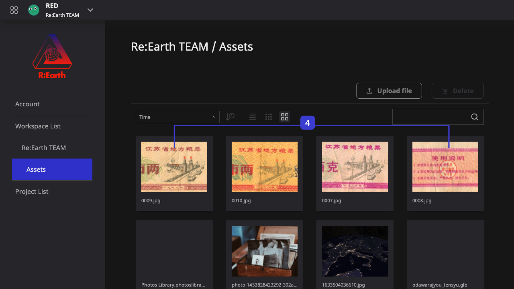
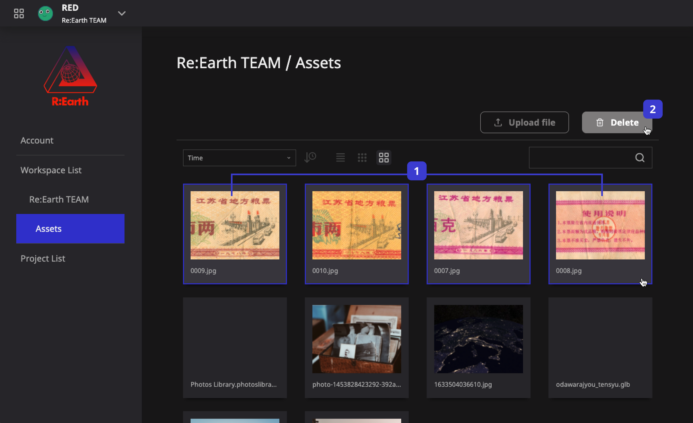
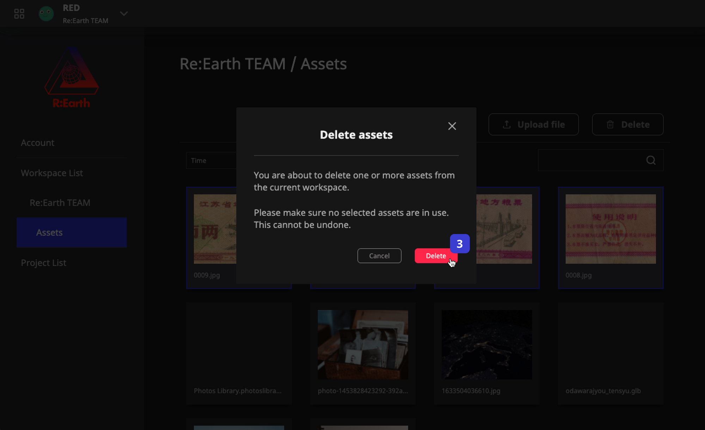
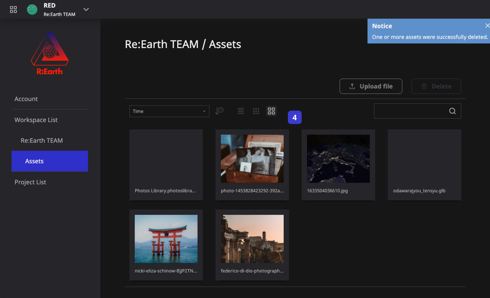
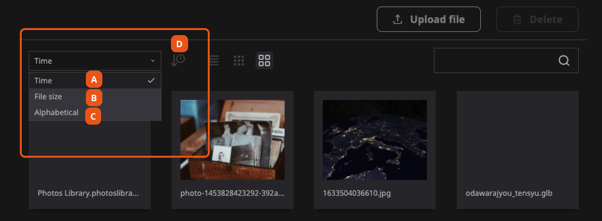
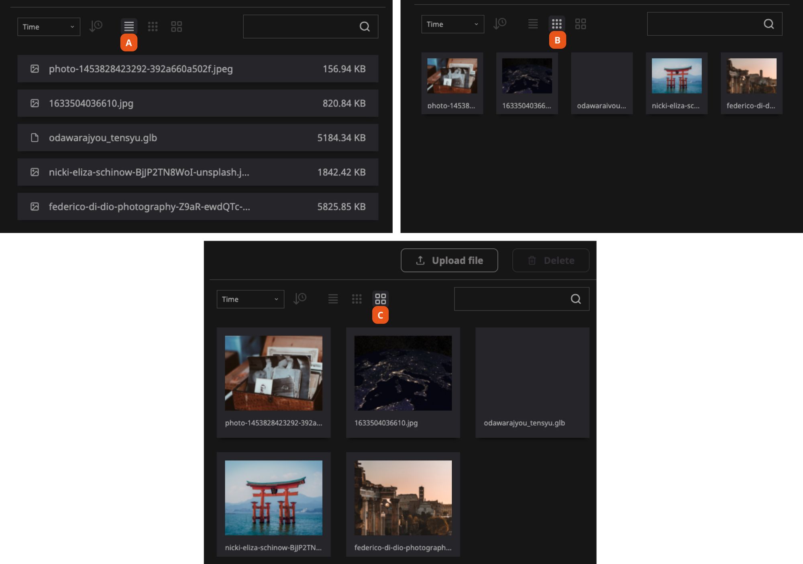
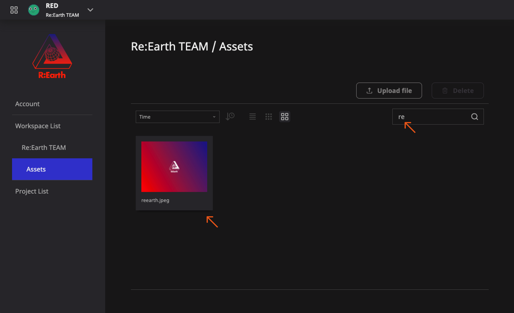

# **Assets Library**

When making a project, a lot of pictures, models and other resources are often needed. In Re-Earth, we collectively refer to them as Assets. Asset resources are stored and managed by the workspace, which means that different projects can share the same asset library, which is helpful if a workspace has multiple related projects.

You can find the assets library in Settings under your current workspace in the navigation bar, where you can easily view and manage all the assets.

1. **Upload file** and **Delete** asset(s) buttons.
2. **Asset filtering, display, and search** functionality panel.
3. **Assets cards** showcasing your library however you have chosen in the functionality panel. Defaults to showing the full library as large cards and is filtered by time.

## How to add assets

We can add new assets to the library through the settings, and we can conveniently add assets while editing the project as well. In the case of the settings, Re-Earth supports selecting multiple files at once so you can upload many files to the library at a time.

1. Click the **Upload file** button.
2. Select the file(s) you want to upload in the opened system window.
3. Click the **Open** button.
4. You should find that the new assets have been successfully uploaded and are now displayed in your library.

## How to delete assets

Whereas adding an asset is possible from both the settings and while editing your project, deleting assets only happens in the settings. Deleting multiple at once is also possible.

1. Select the asset(s) you want to delete.
2. Click the **Delete** button in the upper right corner.
3. Confirm your actions.
4. All selected assets should be deleted.

## Find the asset you want

As the number of assets increases, there will be more and more items in your library making it harder for you to find the one you want to use. We provide a panel of card management functions to help you.

### Filtering
Re-Earth provides a drop-down list of filters so you can customize the viewing order of assets, as you can see in the following picture:

1. Arrange asset cards in order of file upload **time**.
2. Arrange asset cards in order of file **size**.
3. Arrange asset cards by file **name**.
4. For each filter, you can use this button to toggle the reverse order.

### Card style
Re-Earth currently provides three ways to view the asset library:

1. **List style** prioritizes showing the file information (name, file size, and import date) in a simple list. Ideal for many data-oriented assets.
2. **Small card** styles can see more assets on the page at once.
3. **Large cards** have a larger preview space. Ideal for many picture assets.

### Search by file name

Of course, if you know its name, the most direct way to find an asset is to search for the file name.

Enter the file name in the search box and only matching results will be displayed below.

There are various places in Re-Earth to use assets. Usage details about assets will be introduced in their respective sections.

