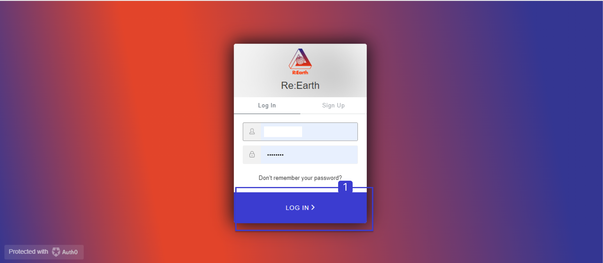

# **Create a new team workspace**

## What is a Workspace?

In the Re-Earth App, a Workspace refers to a digital environment where users can plan, design and manage sustainable projects. It is a collaborative platform that allows users to work on a project, and track progress.

Within a Workspace, users can create and manage different projects, Add team Members, and assign tasks to team members. They can also upload and share files, such as images, videos, and documents.

### Steps to Create a Workspace in the Re-Earth App

**1. Open the Re-Earth app and log in to your account.**

1.  **Click on the Workspace**

1. **Enter a name for your workspace and select Create**

**New Workspace Created**          

### Illustration of How to Create a New Team Workspace

[**settings and deleting**](./settings-and-deleting.md)