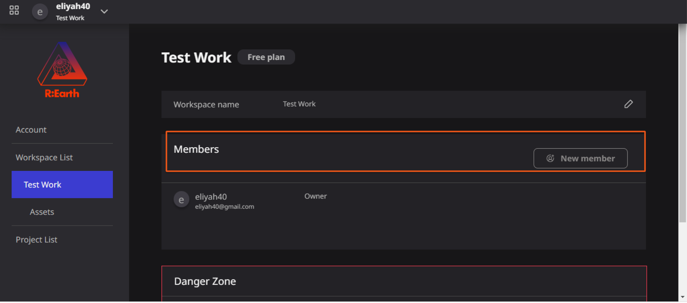
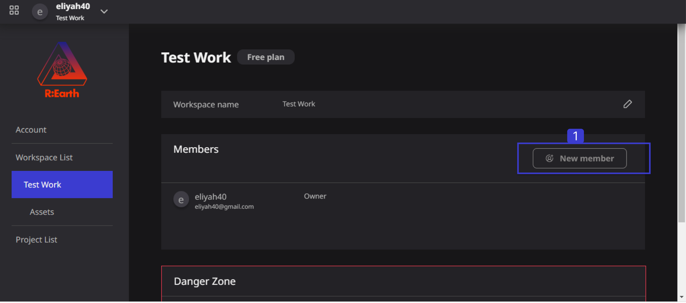
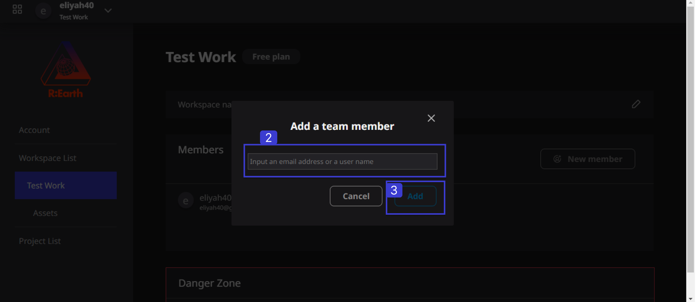
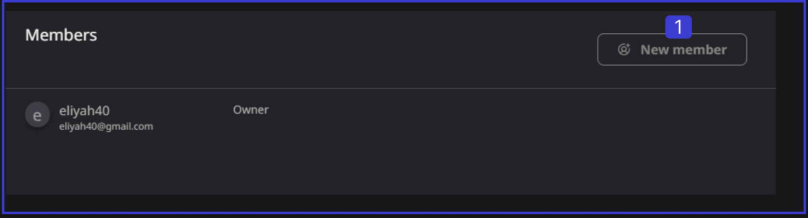
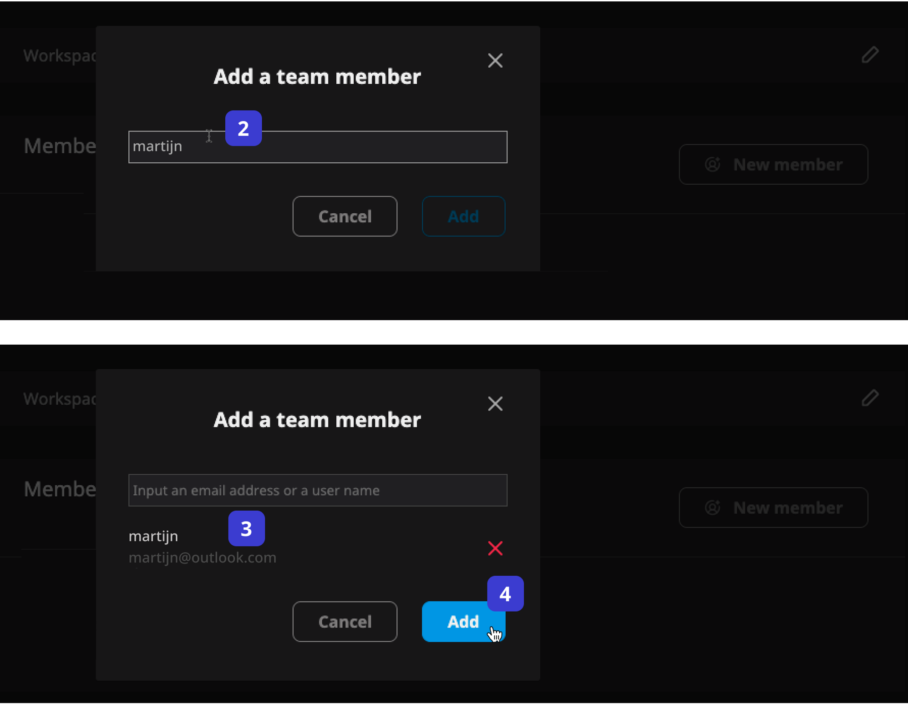
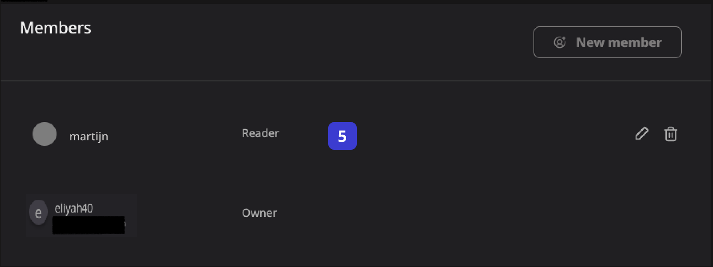

# **Managing members**

The Managing Member is a section in the Re-Earth App workspace, where you can add, rename, delete, and change member roles.

### Steps to Add a New Member

1. **New Member:**  The NEW MEMBER button is used to add a new Member to the USER Workspace. The button will be your first step to adding new members.

1. In the Add a team member Section, the Users will have to add an Email address or the user name of the person.
2. Add: click on the ADD button to be able to add a new team member to your workspace.

## Invite new members 

Follow the steps below to invite new members:

**Steps:**

1. Click the **New Member** button, and the **Add a team member** modal will appear.
2. Fill in the username or email address of the registered user you want to invite.
3. Check whether the search result is the correct user.
4. After confirming that it is correct, click the **Add** button.
5. The member will now appear in your members list.

**[Assets Library](./assets-library.md)**