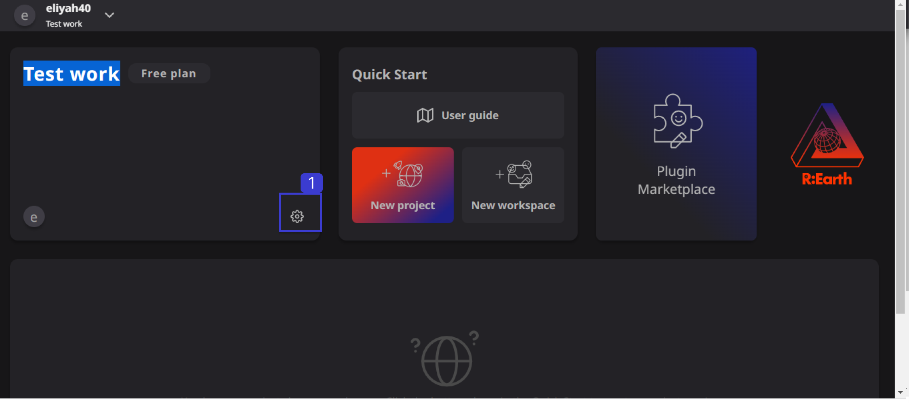
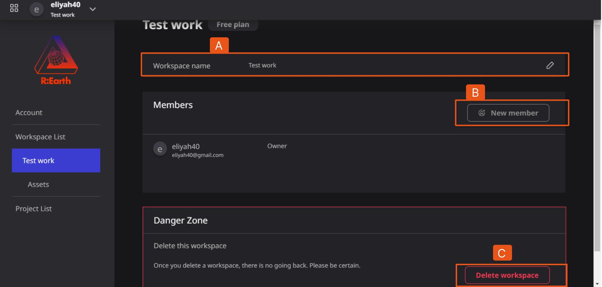
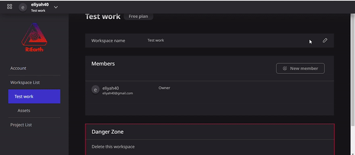
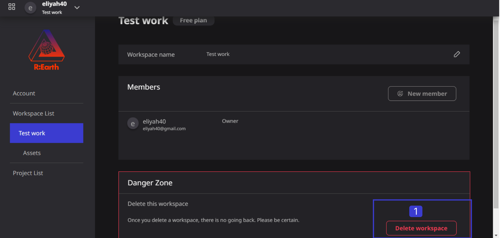
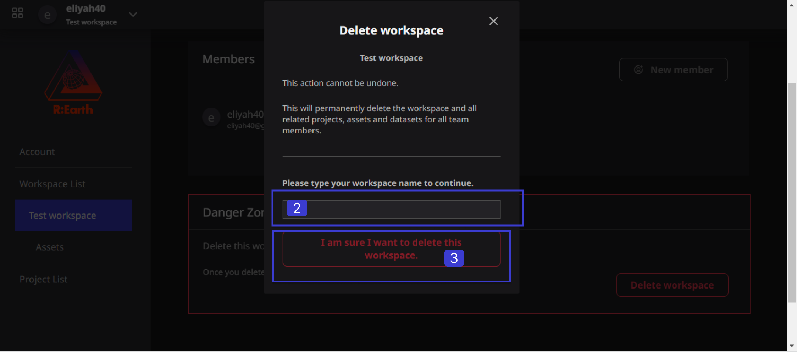
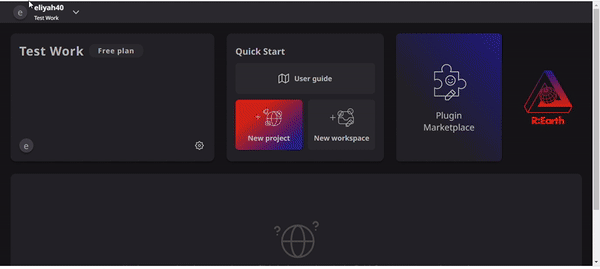

# **Settings and deleting**

## **Settings**

The Re-Earth APP workspace Settings is a section that users can use to edit basic information about the workspace, manage members or delete the workspace.

**Locating the Settings**

Click on the settings icon that looks like a gear to locate the Workspace settings

       

**The Re-Earth app Workspace settings**

**(A) Workspace name:**

This is a section where you can the name of the workspace a user has created. In this section, the user can rename the workspace. 

**(B) New member:**

This section allows users to manage the members in the workspace. For details, please refer to **[Managing Members](./managing-members.mdx)**

**(C) Delete Workspace:**

This can be found in the **Danger Zone** which contains operations that will affect the accessibility of your workspace. Here you can delete the current workspace.

# **Deleting**

It is the process of Deleting a workspace from the Re-Earth App. Once the action of Deleting a workspace is completed it cannot be Undo.

### How to Deleting a Workspace

1. Click on Delete Workspace in the Danger Zone of the Workspace settings.

1. Type in the name of the workspace you want to delete.
2. Then, Click on (I am sure I want to delete workspace) and then the workspace will be deleted.

**Illustration** 

[Managing Members](./managing-members.md)