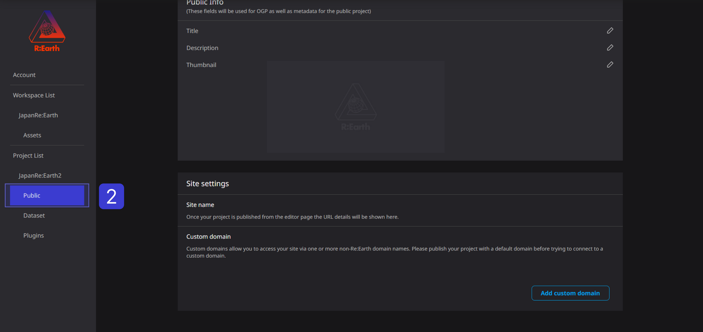

# Public Info SEO ＆ OGP

## Overview of SEO OGP

### **About SEO**

SEO is to increase the access from the search engine and increase the awareness of the website and the effect of attracting customers. Specific efforts include keyword research, optimization of page titles and meta descriptions, and acquisition of external links.

However, **SEO effects may fluctuate due to changes in search engine algorithms and the increase in competing sites. **Therefore, it is necessary to always keep an eye on the latest information and trends and respond flexibly.

### **About OGP**

OGP is a protocol for setting preview images, titles, descriptions, etc. displayed when sharing on SNS.

When sharing the website URL on SNS, the information described in the OGP tag will be displayed as a preview image, title, and description. This allows you to visually convey the content of your website and increase your click-through rate.

## The setting method is as follows

(1) Click the setting button of the corresponding project in the workspace.

(2) Click Public settings.

③ Describe the page title and project overview in the public detailed settings and upload the thumbnail image

Set each in the following ABC locations. After entering, click the ✓ mark to save.

**A** . By including **SEO-conscious KW** in the page title, it is possible to have users browse more effectively.

**B** . For the project outline, **Including KW that is conscious of SEO** will make it more effective

It can be viewed by users.

C: Thumbnail image size should be (400×600px).

That's it for the settings.