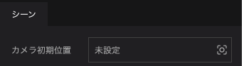
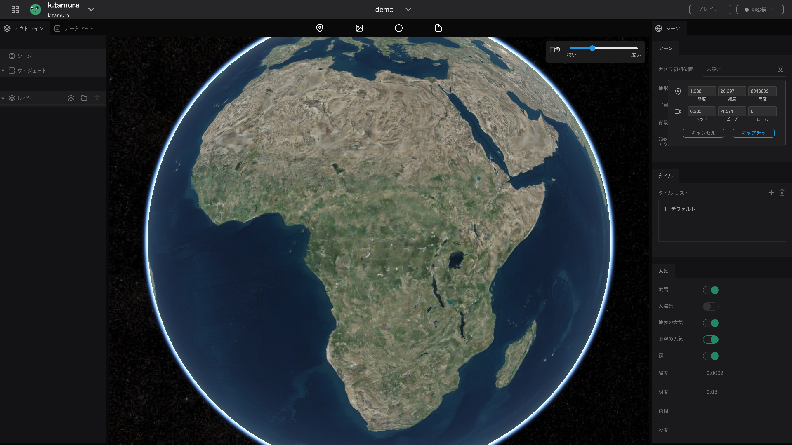
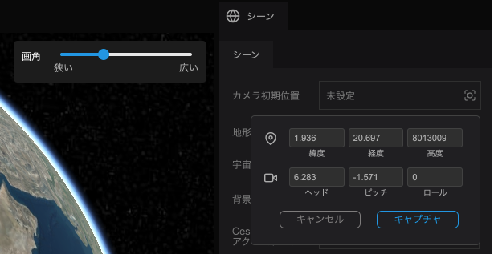
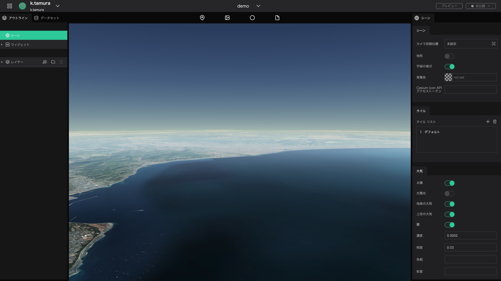
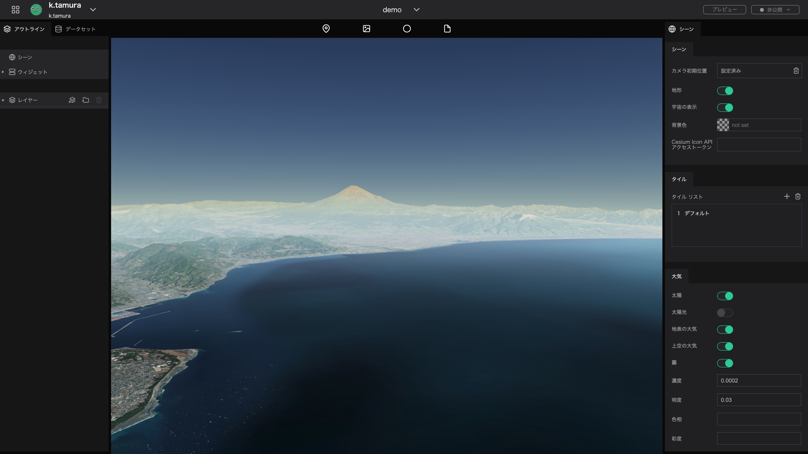
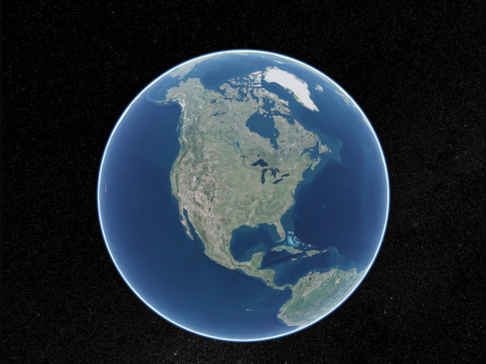
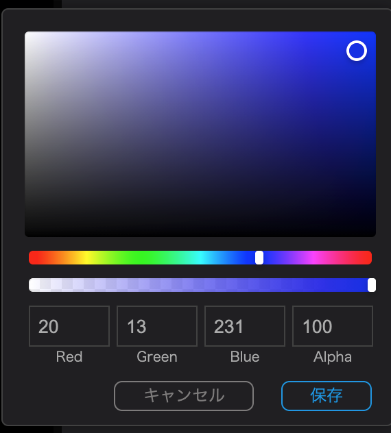
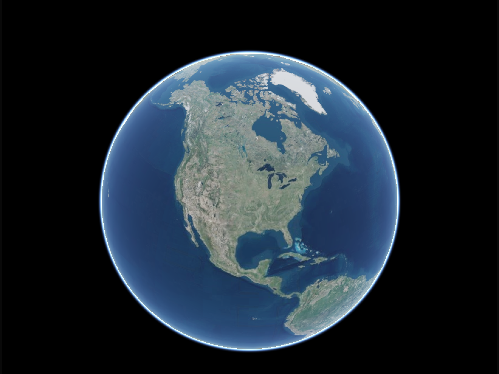
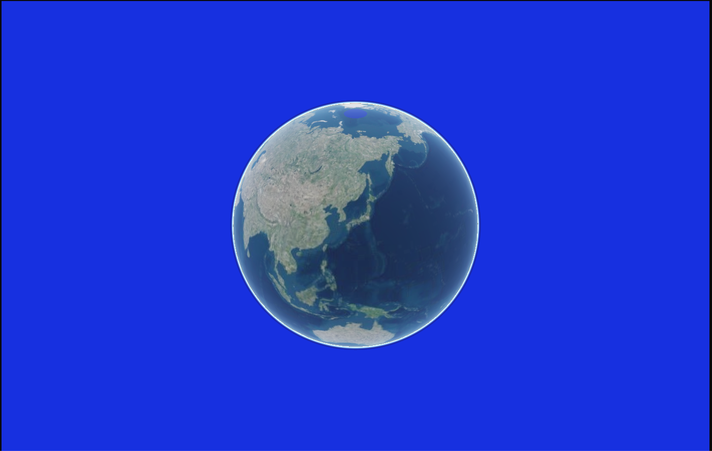

In a scene you can configure settings related to the entire project, the Digital Earth background, and more. This section explains how to set up a scene.

## Scene group

## Set the initial camera position

In Re:Earth, the default setting is to display all of North America. You can change the camera position to be displayed on page load by setting the initial camera position.

- Move the digital earth to the desired location.

- Click Capture

### Show Terrain

If the currently used map tile has height information you can toggle a three-dimensional representation of terrain on the map.

Click the Terrain toggle.

No terrain

With terrain

### Space view

The Sky toggle enables using space as the background.

 Click the Sky toggle.

No sky.

With sky.

### Set background color

With the background color setting you can set the background color seen if the sky is not enabled.

Disable the `sky` and click `not set` for the background color.

Select any color from the displayed color panel and click Save.

Before

After

### Cesium ion API access token

The Cesium ion API access token enables the use of Cesium ion assets (map tile data, 3D data, etc.). To do so, register with Cesium ion and set the API key issued by your Cesium ion account to your project.