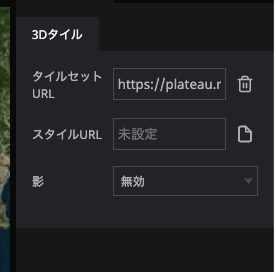

# 3Dタイル

3Dタイルツールを用いると、3D Tiles 形式のタイルデータをデジタルアース上に表示することができます。

3D Tilesとは、立体の建築物など、様々なオブジェクトを広い範囲にわたって表示することができるデータフォーマットです。3D Tiles に関する技術的な詳細は、[3D TIles](https://github.com/CesiumGS/3d-tiles/tree/main/specification) を確認してください。

## 設定項目

- `タイルセットURL` : 3Dタイルが配信されているURLを指定します。必ず `tileset.json` で終了するURLになっていることを確認してください。
    - URL入力欄をクリックするとアセットモーダルが表示されます。アセットモーダル内の `URL` タブを選択すると、URLを入力することが可能です。
- `スタイルURL` : 3Dタイルのスタイルを変更したい場合は、 [3D Tiles Styles](https://github.com/CesiumGS/3d-tiles/tree/main/specification/Styling) 形式のJSONファイルのURLを指定します。
- `影` : 3Dモデルに関する影のON・OFFを切り替えます。影を有効にしたい場合、シーンの設定でも影を有効にする必要があるのでご注意ください。

# Re:Earthで利用可能な3Dタイルデータ

Re:Earthでの利用を想定し、PLATEAUで一般公開されている3Dタイルデータをサーバーへ用意しました。以下のURLを用いて、すぐにテストいただくことが可能です。

PLATEAUについて詳しくは、[公式サイト](https://www.mlit.go.jp/plateau/)をご覧ください。

これらのデータはRe:Earth上での利用を想定しており、Re:Earth以外のアプリケーション等での無断利用を禁止しています。不正利用だと考えられる動きが検知された際、ユーザーへ断りなくデータの配信停止等の処置を取らせていただく場合がございます。

|名前           |タイルセットURL                                                            |
|-------------|---------------------------------------------------------------------|
|千代田区         |https://plateau.reearth.io/13101_chiyoda-ku/tileset.json             |
|千代田区（テクスチャなし）|https://plateau.reearth.io/13101_chiyoda-ku_notexture/tileset.json   |
|中央区          |https://plateau.reearth.io/13102_chuo-ku/tileset.json                |
|中央区（テクスチャなし） |https://plateau.reearth.io/13102_chuo-ku_notexture/tileset.json      |
|港区           |https://plateau.reearth.io/13103_minato-ku/tileset.json              |
|港区（テクスチャなし）  |https://plateau.reearth.io/13103_minato-ku_notexture/tileset.json    |
|新宿区          |https://plateau.reearth.io/13104_shinjuku-ku/tileset.json            |
|新宿区（テクスチャなし） |https://plateau.reearth.io/13104_shinjuku-ku_notexture/tileset.json  |
|文京区          |https://plateau.reearth.io/13105_bunkyo-ku/tileset.json              |
|文京区（テクスチャなし） |https://plateau.reearth.io/13105_bunkyo-ku_notexture/tileset.json    |
|台東区          |https://plateau.reearth.io/13106_taito-ku/tileset.json               |
|台東区（テクスチャなし） |https://plateau.reearth.io/13106_taito-ku_notexture/tileset.json     |
|墨田区          |https://plateau.reearth.io/13107_sumida-ku/tileset.json              |
|墨田区（テクスチャなし） |https://plateau.reearth.io/13107_sumida-ku_notexture/tileset.json    |
|江東区          |https://plateau.reearth.io/13108_koto-ku/tileset.json                |
|江東区（テクスチャなし） |https://plateau.reearth.io/13108_koto-ku_notexture/tileset.json      |
|品川区          |https://plateau.reearth.io/13109_shinagawa-ku/tileset.json           |
|品川区（テクスチャなし） |https://plateau.reearth.io/13109_shinagawa-ku_notexture/tileset.json |
|目黒区          |https://plateau.reearth.io/13110_meguro-ku/tileset.json              |
|目黒区（テクスチャなし） |https://plateau.reearth.io/13110_meguro-ku_notexture/tileset.json    |
|大田区          |https://plateau.reearth.io/13111_ota-ku/tileset.json                 |
|大田区（テクスチャなし） |https://plateau.reearth.io/13111_ota-ku_notexture/tileset.json       |
|世田谷区         |https://plateau.reearth.io/13112_setagaya-ku/tileset.json            |
|世田谷区（テクスチャなし）|https://plateau.reearth.io/13112_setagaya-ku_notexture/tileset.json  |
|渋谷区          |https://plateau.reearth.io/13113_shibuya-ku/tileset.json             |
|渋谷区（テクスチャなし） |https://plateau.reearth.io/13113_shibuya-ku_notexture/tileset.json   |
|中野区          |https://plateau.reearth.io/13114_nakano-ku/tileset.json              |
|中野区（テクスチャなし） |https://plateau.reearth.io/13114_nakano-ku_notexture/tileset.json    |
|杉並区          |https://plateau.reearth.io/13115_suginami-ku/tileset.json            |
|杉並区（テクスチャなし） |https://plateau.reearth.io/13115_suginami-ku_notexture/tileset.json  |
|豊島区          |https://plateau.reearth.io/13116_toshima-ku/tileset.json             |
|豊島区（テクスチャなし） |https://plateau.reearth.io/13116_toshima-ku_notexture/tileset.json   |
|北区           |https://plateau.reearth.io/13117_kita-ku/tileset.json                |
|北区（テクスチャなし）  |https://plateau.reearth.io/13117_kita-ku_notexture/tileset.json      |
|荒川区          |https://plateau.reearth.io/13118_arakawa-ku/tileset.json             |
|荒川区（テクスチャなし） |https://plateau.reearth.io/13118_arakawa-ku_notexture/tileset.json   |
|板橋区          |https://plateau.reearth.io/13119_itabashi-ku/tileset.json            |
|板橋区（テクスチャなし） |https://plateau.reearth.io/13119_itabashi-ku_notexture/tileset.json  |
|練馬区          |https://plateau.reearth.io/13120_nerima-ku/tileset.json              |
|練馬区（テクスチャなし） |https://plateau.reearth.io/13120_nerima-ku_notexture/tileset.json    |
|足立区          |https://plateau.reearth.io/13121_adachi-ku/tileset.json              |
|足立区（テクスチャなし） |https://plateau.reearth.io/13121_adachi-ku_notexture/tileset.json    |
|葛飾区          |https://plateau.reearth.io/13122_katsushika-ku/tileset.json          |
|葛飾区（テクスチャなし） |https://plateau.reearth.io/13122_katsushika-ku_notexture/tileset.json|
|江戸川区         |https://plateau.reearth.io/13123_edogawa-ku/tileset.json             |
|江戸川区（テクスチャなし）|https://plateau.reearth.io/13123_edogawa-ku_notexture/tileset.json   |
|川崎市         |https://plateau.reearth.io/14130_kawasaki-shi/tileset.json             |
|川崎市（テクスチャなし）|https://plateaureearth.io/14130_kawasaki-shi_notexture/tileset.json   |