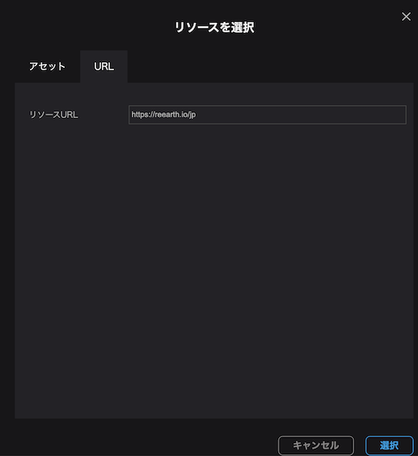
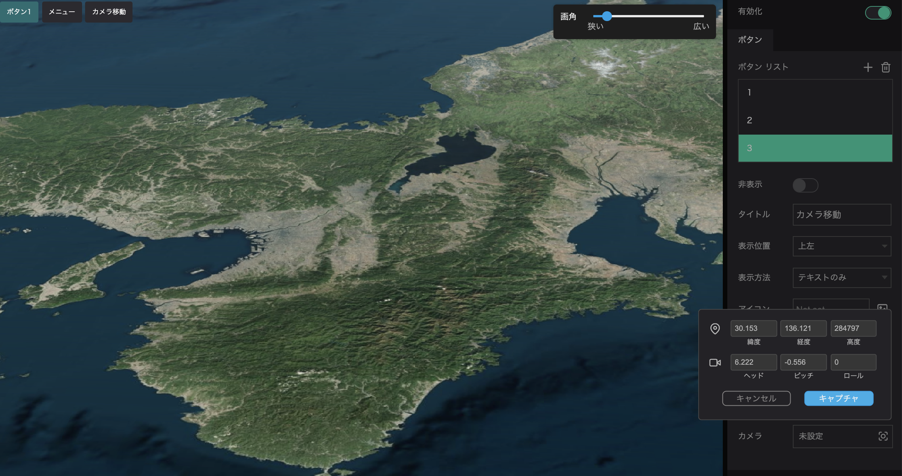

To set up a button, go to `Widgets` in the Outline tab and click on `Menu`. Menu settings will appear on the right side of the screen. 

Click `Enable` and then click `+` in the Button List to add a button.

The following can be configured in the button settings:

- Hide: Toggles between showing and hiding the button.
- Title: Enter a display name for the button.
- Position: Select the display position of the button from top left, top right, bottom left, or bottom right.
- Style: Choose to display the button as text only, icon, or text and icon.
- Icon: If you choose to display the button as an icon or text and icon, the button will be displayed as the icon chosen here.
- Text Color: Allows you to change the text color of the button.
- Background Color: Allows you to change the background color of the button.
- Type: You can select the action to be taken when the button is clicked, such as opening/closing the menu, linking, or moving the camera. The actions for each are as follows
    - Menu Open/Close: Clicking the button will open a menu with more buttons.
    - Link: Click to access the specified address.
    - Camera flight: Click to move the camera.

## Set a button to display the link.

Click the button to display the specified web page.

- Select the link from the action.
- Click on the link field, and the resource selection window will appear.
- Select the URL tab, enter the address in the Resource URL field, and click `Select` to set the URL for the button.

## Set the menu open/close button.

You can set a button to display a menu when clicked.

By displaying the menu, many buttons can be prepared in a compact size.

Set the action of the button to `Menu`.

Click `+` in the menu list to add a menu item.

- Title: Enter the display name of the menu button.
- Icon: To display an icon on the menu button, specify the icon.
- Type: Select the action to be taken when the menu is clicked. The actions for each are as follows
    - Link: This button will take you to the specified link when clicked.
    - Camera: Click on this button to move the camera.
    - Break: Makes the menu item a delimiter.

## Camera move

You can create a button that moves the camera to a specified location when clicked.

Select `Camera` in the button action.

Click on the camera item to display the view angle setting window. Enter values for latitude and longitude, etc., or move the map with the mouse and click `Capture` to set the angle of view.

