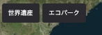

Widget is a general term for other features that are not placed on the digital earth, but are placed flat over the scene. The widgets that Re:Earth currently provides officially include **menu buttons** that fire specified events(camera movement, links to external sites, etc.), a **splash screen** to set the screen that appears when the project is launched, and a **storytelling** feature that moves the layers in the project in order.

## Button

## Splash screen

## Storytelling

