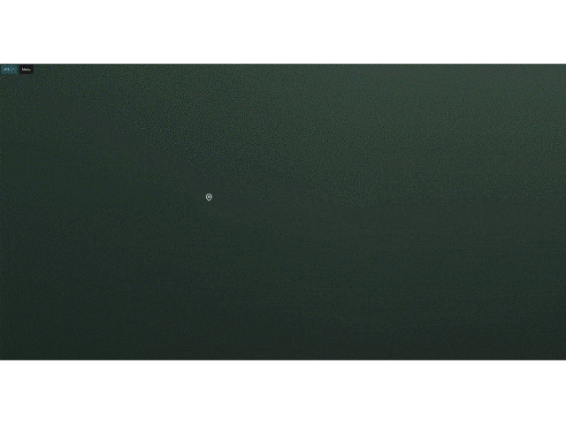

The splash screen is a feature that displays an image with text in full screen when a project is launched.

This is suitable for displaying the project title and other information.

## Configure the splash screen image

- Clicking on `Splash screen` in the widgets section of the left panel will make the splash screen settings toggle appear on the right panel. Click the Enable toggle to start using the splash screen.

- Delay: Specify the time (in seconds) from the start of the project until the splash screen is displayed.
- Duration: Specify the time (in seconds) to keep the splash screen displayed.
- Fade out: Specify the time (in seconds) that it will take for the splash screen to fade out.
- Image: Specify the image for the splash screen.
- Image width: Specify the width of the splash screen's image.
- Image height: Specify the height of the splash screen's image.
- Background color: Specify the color of the area around the image when the splash screen is displayed.

## Settings for camera movement during the splash screen

In the Camera flight sequence List, you can configure settings related to the camera movement of the map while the splash screen is displayed.

- Click the `+` in the camera animation list to add a list of cameras.

- Camera Position: Set the position of the camera to the map when the splash screen is displayed.

Enter the latitude and longitude, the altitude, and the angle of the camera, or move the camera to position with your mouse and Cesium keybindings, then click `Capture`.

- Duration: Specify the time (in seconds) it takes to move the camera.
- Delay: Specify the time (in seconds) between accessing the project and starting the camera movement.

By adding multiple camera animations to the list, you can move the camera to multiple locations during the splash screen.

The camera animations will be executed in order from the top of the list.