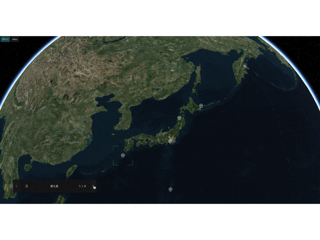

Storytelling allows you to navigate through specific layers in your project in a chosen order.

## Enable storytelling

Clicking on `Storytelling` in the widgets section of the left panel will make the storytelling settings toggle appear on the right panel. Click the Enable toggle to start using storytelling.

In storytelling, you need to set up two items: `storytelling`  and `stories`.

## Storytelling

- Range: Specify the distance from the layer to the camera.
- Camera pose: Specify the viewing angle of the camera.

Clicking on the `Camera pose`'s  input (it should say "Not set") will open a editor popup. Enter the desired values or adjust the angle of view on the map and click `Capture` to set the viewing angle during storytelling.

Auto start: When checked, the first layer in the storytelling list will be selected when the project is launched.

## Stories

This is the setting where you choose which layers will be shown and in what order while using storytelling.

### Add Stories

Click the `+` button in the story list to open the Layer selection window.

Select the layer(s) you want to add from the selectable layers, and click the `Add` button to add the layer(s) to the story list to be displayed.

Also, storytelling will be played in order from the top of the story list.

### Camera settings for story

While playing back a story, you can set the angle of the camera for each layer (which will bypass the Storytelling's Camera pose setting.

Click on the layer of interest from `stories list`.

Duration: Specify the time (in seconds) it takes to move to the layer.

Range: Specify the distance from the layer to the camera.

Camera position: Specify the angle of the camera.

### Run Storytelling

When Storytelling is enabled, the Storytelling menu will appear in the bottom left corner of the screen.

You can jump to the next layer with `>`, and `<` will allow you to return to the previous layer. You can also attach an infobox to a layer to be viewed at the same time as you display the layer.

[See here](/user-manual/infobox/set-up-infobox-properties) for infobox settings.

Also, if the selected layer is a photo overlay, the set image will be shown.

You can also go directly to a specific layer by clicking `≡`, which will show the story list, and then selecting the desired layer's name.

