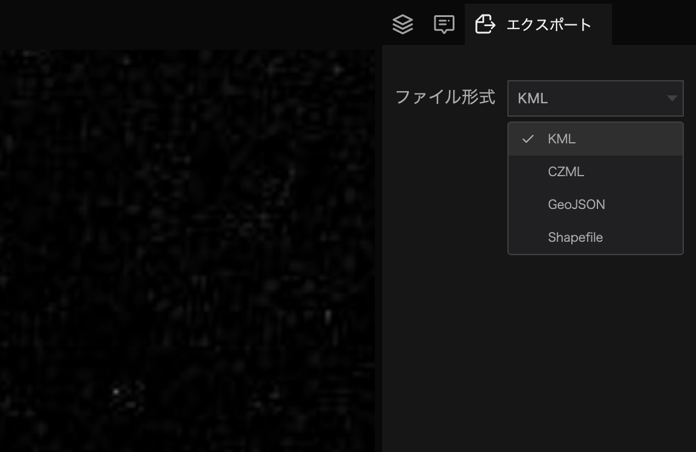
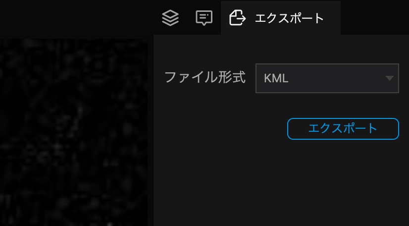

From the `Outline` tab of the left panel select the `layer` or you want to export.

(Dataset, file, marker, photo overlay, and sphere tools can all be selected.)

When exporting a layer, all data contained in the selected layer will be exported as one file. For example, if you select a single layer, only that layer will be exported; if you select a layer folder, all child layers in the folder will be exported.

Select the `Export` tab of the right panel.

Select the file format.

Click `Export` to specify a destination and export the data.

