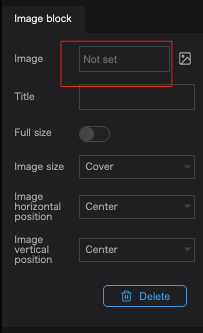

Add an image to an infobox.

Click the `+` button in the info box.

Click on the `Image` button.

Click on the image in the image box properties to display the image selection assets.

Select an image from the assets, or paste the URL of the desired image.

(Click [here](../asset/upload-a-new-asset) for more information about assets)

- Select an image from an asset.

- To paste an image URL, please enter the image URL from the URL tab of the modal.

