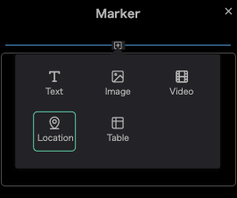
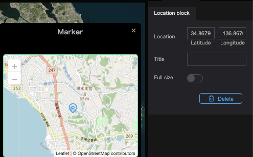

The location block allows you to put a map in the infobox.

Click the `+` in the infobox.
Click the `Location`.

Enter the latitude and longitude in the location field in the properties and a map at that location will be displayed in the location box.

