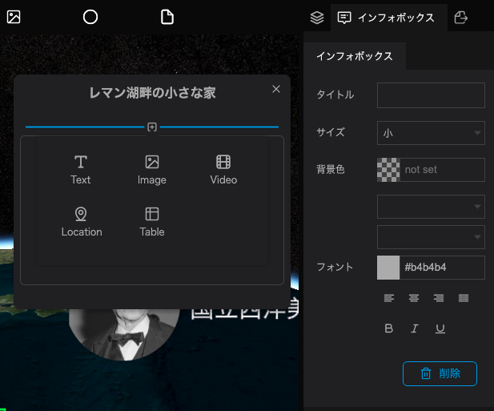
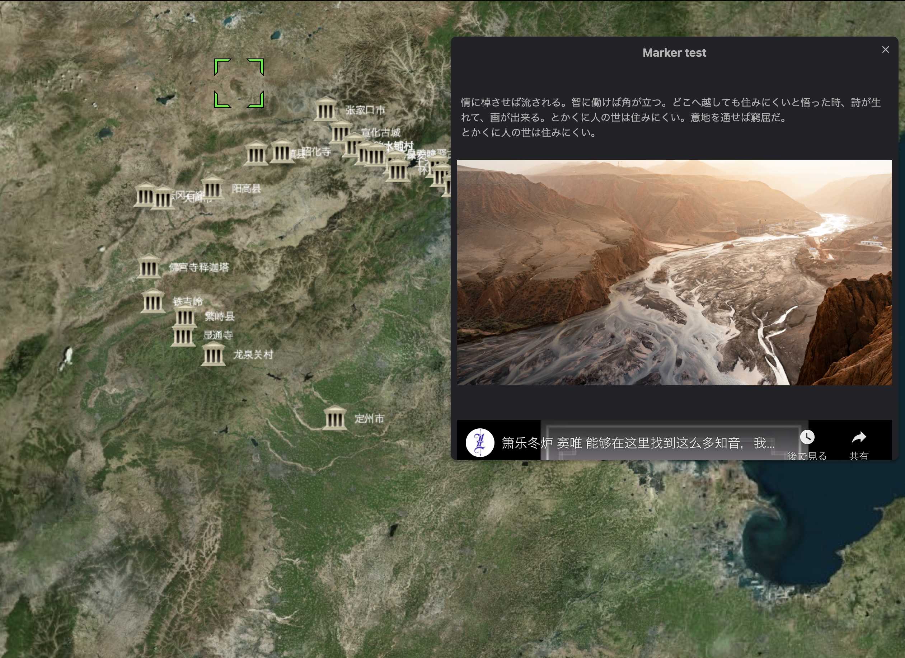
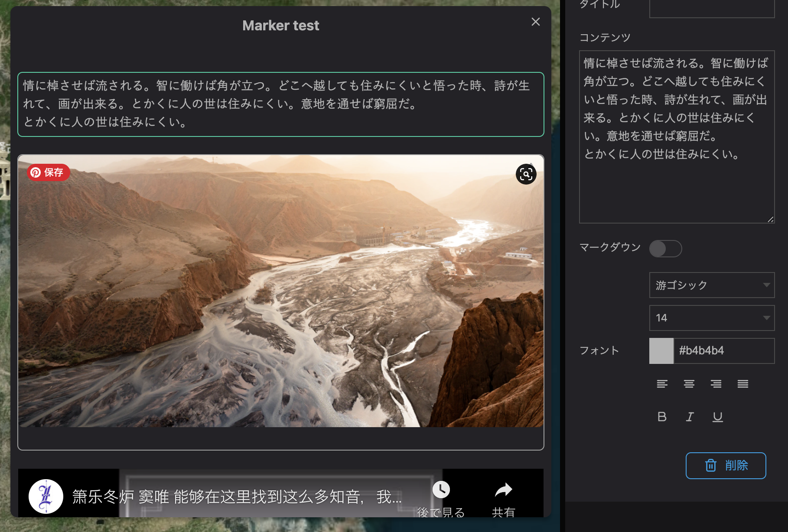

An infobox is a box that can appear when a viewer clicks on a layer on the map.

The infobox can display text, images, videos, etc.

The typeface and format specified in the infobox settings will be inherited by each block unless otherwise specified in respective settings.

By setting up an infobox, you can attach detailed information to the layer.

The text and images to be inserted in the infobox will be managed by blocks.

Infoboxes with images and text set can be seen in the published scene when a layer is selected.

