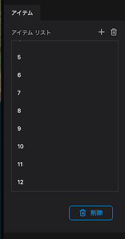
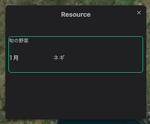

The Table block allows you to add a table in the infobox.

Select `Table` from the infobox `+` button.

Enter text for the title in the properties of the table block.

Press the `+` button to the right of the item's item list to add table items.

Select an item in the `item list`.

- Enter text for the title.
- For the type, press the pull-down menu and select either `letter` or `number`.
- Enter text in Data. (If you selected numbers, enter numbers.)

The data will be displayed in the table.

Similarly, by entering the value of an item, you can display it in a tabular format.

