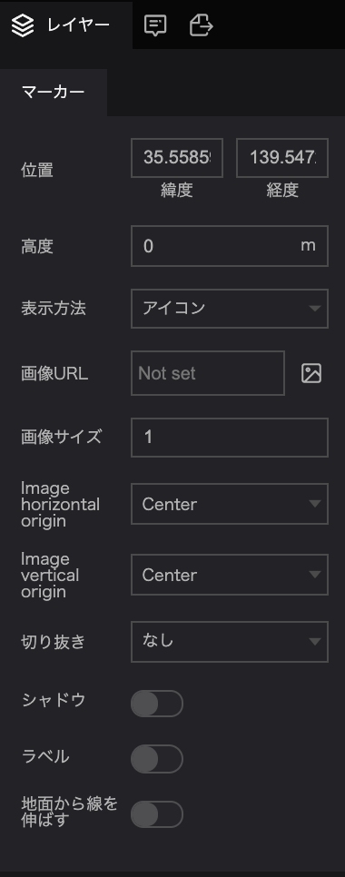
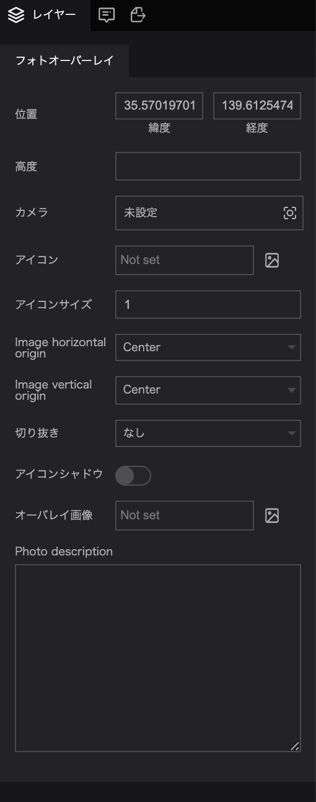
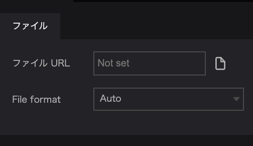
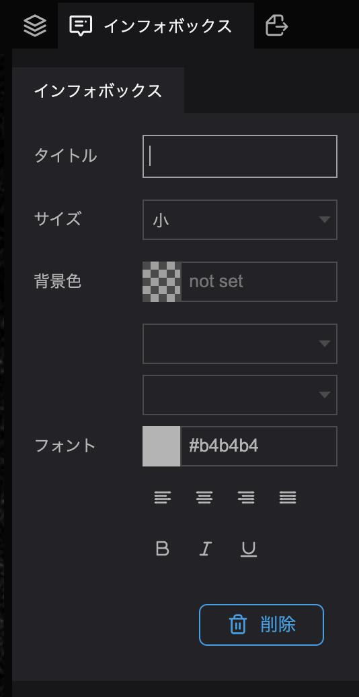
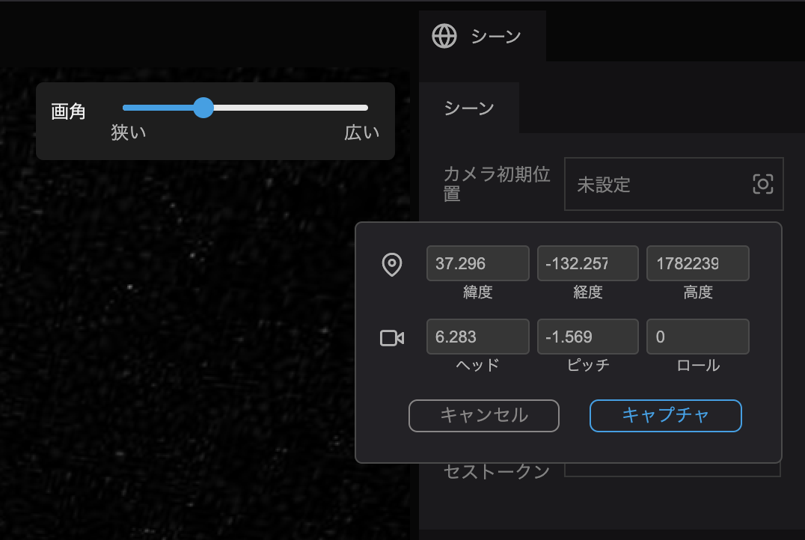
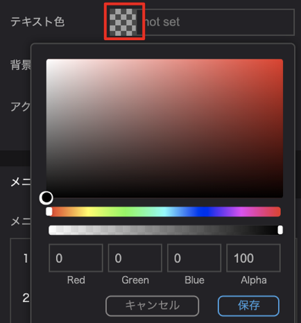
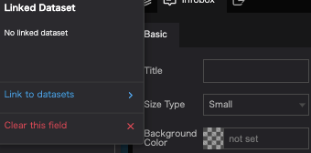
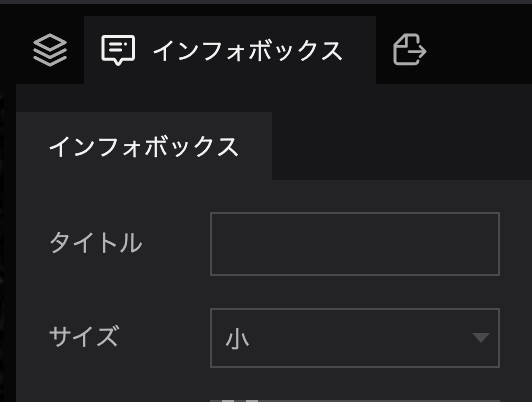

## Properties

Properties are the individual customizable items found in the right panel when something is selected in the left panel (as indicated by the red arrows in the image below).

See and change default settings for scenes, infoboxes, markers, etc. when the properties field is shown.

## Marker properties

Properties can be changed in the menu that appears on the right side of the screen when you click on a layer, widget or scene.

### Marker Properties

The marker properties allow you to set the following items:

- Position: Indicates the position of the marker.
- Altitude: Sets the ground altitude of the marker.
- Display method: You can select either point or icon. If you select point, you can change the color and size of the point. For icons, you can set the image, size, and placement.
- Shadow: You can add a shadow to the marker.
- Label: Allows you to add a label to the marker.
- Extend line from ground: Allows you to set whether or not to extend a line between the marker and the ground surface when the altitude is set for the marker.

### Photo overlay properties

The following items can be set in the photo overlay:

- Position: Set the position to display the photo overlay.
- Altitude: Set the altitude at which the photo overlay will be displayed.
- Camera: Set the viewing angle for showing the photo overlay.
- Icon: Specify the icon to be shown as the marker of the photo overlay.
- Icon size: Sets the size of the icon.
- image horizontal origin: Selects the image placement from left, center, or right.
- image vertical origin: Selects the image placement from top, center, baseline, and bottom.
- Crop: Sets whether the image will be cropped to a circular shape or not.
- Icon shadow: Sets whether the icon will have a shadow.
- Overlay image: Specify the image for the photo overlay.
- Photo description: Enter a description for the photo overlay.

### Sphere Properties

The Sphere tool allows you to set the following items:

- Position: Set the position where the sphere will be displayed.
- Altitude: Set the altitude at which the sphere will be displayed.
- Radius: Set the radius of the sphere.
- Fill color: Set the color of the sphere.

### File Properties

In the file properties, you can set the following items:

- File URL: Select the data to be loaded as a file.
- File format: Select the extension type of the file to be loaded.

## Additional Information

### Change the title property of the infobox

Click on the title entry field and type in the text.

### Change camera properties

You can change the properties of the camera in the scene settings and elsewhere.

Click the `unset` button next to the property name.

In the popup that appears, enter the position and angle you want and click `Capture`.

(Click [here]( /user-manual/1.0/scene/set-up-scene-group-properties) for more information about the camera in the scene)

### Change image properties

The image property in a photo overlay or image block allows you to specify the image to be displayed.

Click on the `Not set` or `Image icon` to the right of the property.

Select the image from the selection or click Upload Image and add a new image, then click Select.

(Click [here](../asset/upload-a-new-asset) for more information about Media)

### Color settings

To set the color settings for markers, backgrounds or text, you can select a color from the color palette.

Click on the icon of the color setting item to display the color palette.

Select the desired color and click `Save` to set the specified color.

### Initialize property values

To clear the property value you have entered and revert back to defaults, click on the property name and then click `Clear this field`.

