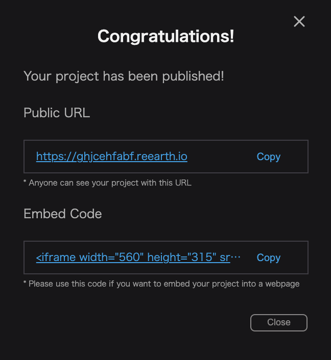

You can embed the project on your own website by using the `embed code` that is displayed when the project is published.

(See [here]( /user-manual/1.0/publication/set-up-the-project-for-publication) for more information on publishing a project.)

By pasting the embed code into the html of your web site, you will see similar to the following:

Reference web site: [https://reearth.io/](https://reearth.io/)