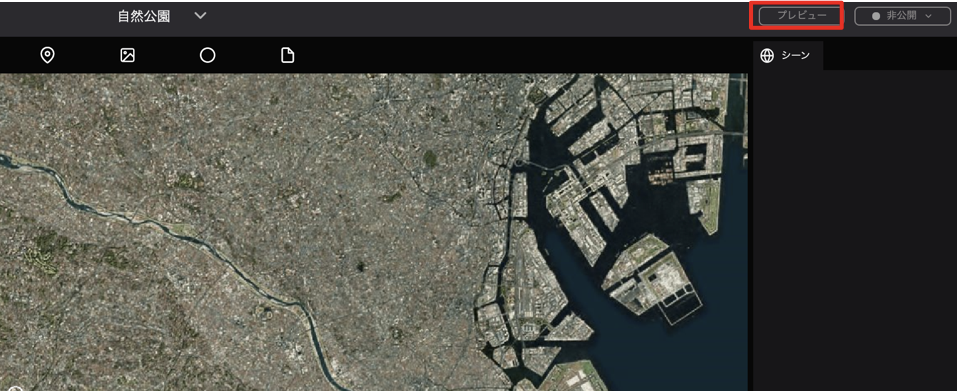

The preview allows you to see how the project you are currently editing will look like after it is published.

To see the preview, click on the `Preview` button in the upper right corner of the screen.

The preview will reflect the current content you have edited so far.

**Note: If the project has already been published, your edits will not be reflected (like they are with Preview) on the published project until you publish it again.**

The preview will open in a new tab in your browser.

