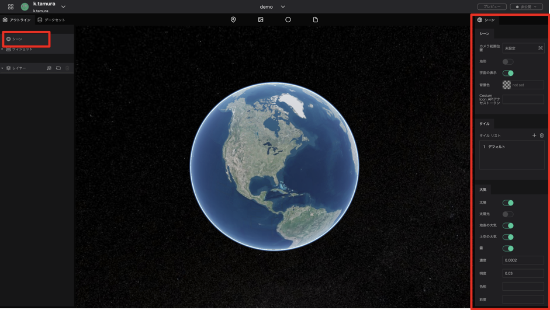

In the scene, you can modify settings related to the entire project and the Digital Earth background.

This section describes the items displayed in the right panel when the scene is selected.

## Scene Settings

1. Initial Camera Position: Set the position of the camera that will be displayed when the page is loaded.
2. Terrain: Toggles between a three-dimensional representation of the terrain and a flat surface when the map tile has height information.
3. Sky: Toggle showing space as the background.
4. Background color: Sets the background color when Sky is disabled.

## Tile Settings

The Tile settings is comprised of a Tile List that shows all the map tiles to be displayed on the Digital Earth and settings for the currently selected tile. You can choose from several existing map tiles, or you can apply externally distributed map tiles by specifying a URL.

1. Plus button：Adds a tile.
2. Trash button：Deletes a tile.
3. Tile Type：Selects the tile type of the selected item.
4. Minimum zoom level：Sets the minimum zoom level for the tile data to be display.
5. Maximum zoom level：Sets the maximum zoom level for the tile data to be display.

## Atmospheric Conditions

Here you can customize settings related to the atmosphere, sun, and fog.

1. Sun: Toggles between showing and hiding the sun in space.
2. Lighting: Toggles between reflecting and not reflecting sunlight on the Digital Earth. This makes it possible to represent day and night by region.
3. Ground atmosphere: Toggles between showing and hiding the atmosphere on the Digital Earth surface.
4. Sky atmosphere: Toggles between showing and hiding the atmosphere above the Digital Earth
5. Fog: Toggles the fog on and off.
6. Fog density: Sets the fog density.
7. Fog Brightness: Set the brightness of the fog.
8. Fog Hue: Sets the color of the fog.
9. Fog Saturation: Sets the saturation of the fog.

## Google Analytics

1. Enable: Check the box to enable Google Analytics. 
2. Tracking ID: If you want to enable Google Analytics, please enter your Tracking ID.

