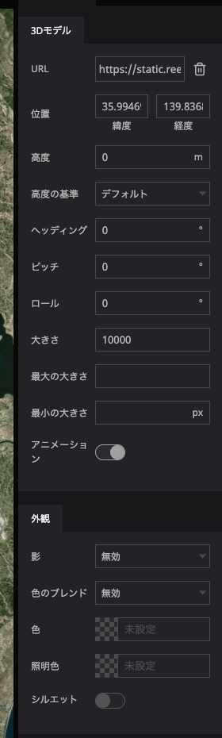

# 3Dモデル

お手持ちの3Dモデルデータをデジタルアース上に配置するためのツールです。

## 対応データフォーマット

- glTF
    - glTF 1.0 または 2.0 をサポートしています。Draco圧縮もサポートしています。
    - glTFには様々な形式がありますが、画像など含めて全てのデータが1つのファイルに埋め込まれている glTF Embedded （ `.gltf` ）または glTF Binary （ `.glb` ）形式を主にサポートしています。
    - 複数ファイルに分かれている glTF Separated （ `.gltf`  + `.bin` + 画像ファイル等）形式は、Re:Earth内でのアップロード表示には対応していません。ただし、適切にCORSが設定されたサーバー上で配信されているファイルURLを直接指定した場合は、表示できることがあります。
- これ以外のフォーマット（例： `.obj`  `.fbx`）はサポートしていません。あらかじめご自身でglTF形式への変換をお願いいたします。

## 設定項目

- `URL` :アップロード済み3DモデルデータのURLを入力することで、表示させることが可能です。
    - URL入力欄をクリックすると、アセットモーダルが表示されます。こちらから3Dモデルのアップロードや選択などが可能です。詳しくはアセットモーダルをご覧ください。
- `位置` : 3Dモデルを表示する緯度・経度を設定します。
- `高度` : 3Dモデルを表示する高さを設定します。
- `高度の基準` : 「デフォルト」・「地表に固定」・「地表からの高度」から選択が可能です。「デフォルト」を選択した場合には、WGS84楕円体（デジタルアース）からの絶対的な高度となります。「地表に固定」及び「地表からの高度」は、シーンで「地形」の設定を有効にした場合のみ「デフォルト」と異なる高さになります。
- `ヘディング` : 3Dモデルの水平方向の角度を指定します。有効範囲は0~360です。
- `ピッチ` : 3Dモデルの垂直方向の角度を指定します。有効範囲は0~360です。
- `ロール` : 3Dモデルの傾き角度を指定します。有効範囲は0~360です。
- `スケール` : 3Dモデルデータの表示サイズを等倍で指定します。
- `最大スケール` : 画面上に表示される最大のスケールです。単位は「大きさ」の設定と同じです。これ以上大きくは表示されません。
- `最小表示サイズ` : 画面上に表示される最小の大きさです。単位はピクセルです。これ以上小さくは表示されません。
- `アニメーション` : 3Dモデルデータに含まれるアニメーションのON・OFFを切り替えます。アニメーションを有効にしたい場合、シーンの設定でもアニメーションを有効にする必要があるのでご注意ください。
- `3Dモデルの影` : 3Dモデルに関する影のON・OFFを切り替えます。影を有効にしたい場合、シーンの設定でも影を有効にする必要があるのでご注意ください。
- `色のブレンド` : 指定した色で3Dモデルを染めることができます。「無効」・「ハイライト」・「置き換え」・「混合」から選択が可能です。「無効」を選択した場合には色のブレンドを行いません。「ハイライト」では、3Dモデルの固有色に設定した色を乗算します。「置き換え」では、3Dモデルの固有色そのものを設定した色で置き換えます。「混合」では3Dモデルの固有色と設定した色で混ぜ合わせます。
- `色` : 3Dモデルの色を設定します。HTMLカラーコードが有効です。
- `色の混合量` : 色の混合量を指定します。有効範囲は0~1です。色のブレンドで「混合」を選んだ場合のみ有効です。
- `照明色` : 3Dモデルの照明の色を指定します。HTMLカラーコードが有効です。
- `シルエット` : 3Dモデルの輪郭線を表示します。
- `シルエット色`  : 3Dモデルの輪郭線の色を指定します。HTMLカラーコードが有効です。
- `シルエット線幅`  : 3Dモデルの輪郭線の幅を設定します。単位はピクセルです。