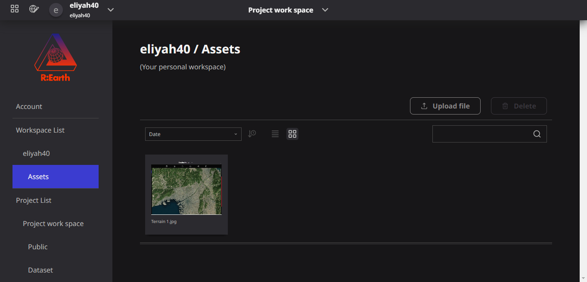
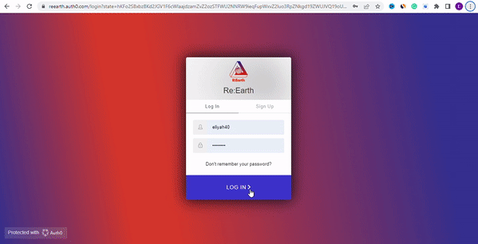

# Idea of assets

## Preview of Assets

## What is an asset?

In Re-earth, an asset is any resource that can be utilized in order to provide user scarification. This can include things like Images, buildings, equipment, and even Documents.

Images and files used in Re-Earth are considered assets.

### Idea of asset

The Idea of Assets is that Assets are tied to workspaces so they can be shared and used across projects.

### You can use image assets as:

- Project thumbnails
- Infobox's image block images
- Photo overlay images
- Layer icons (where applicable)
- Profile image

### How to Locate Asset:

You can access the assets from `Account Settings` -> `Workspace` -> `Assets` as well as through the asset modal where it is used.

**Illustrations on How to Locate Assets**

