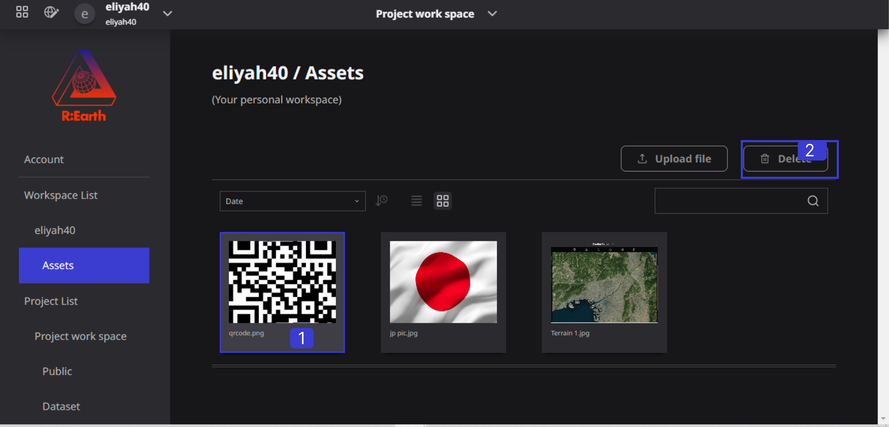
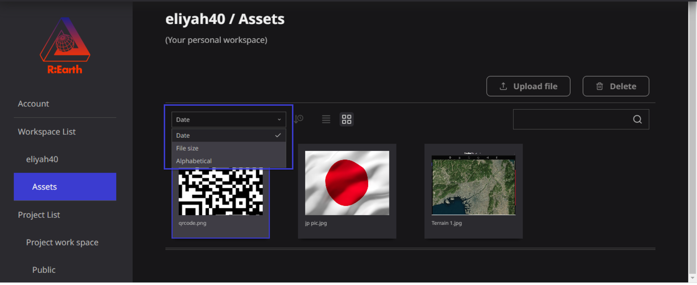
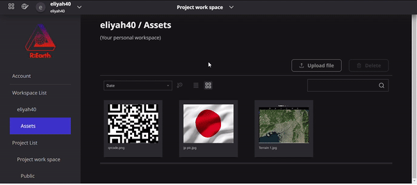
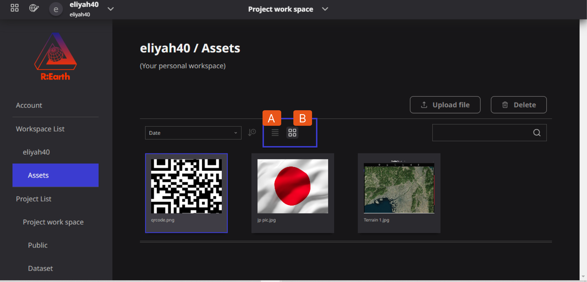
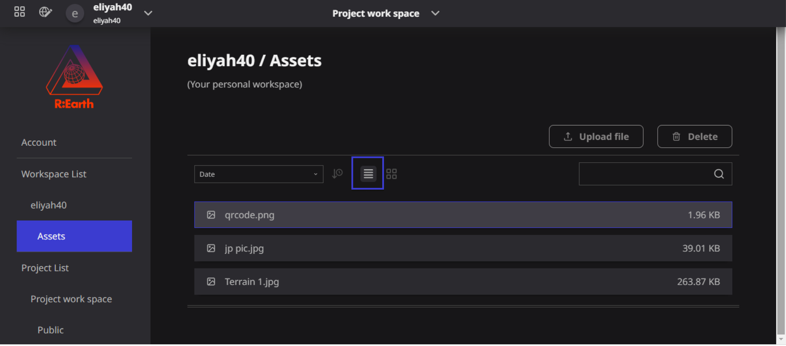
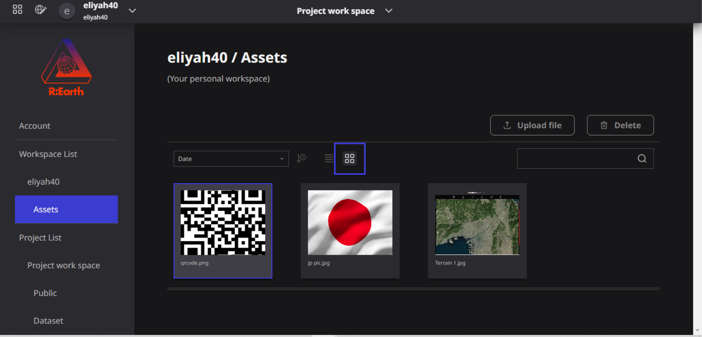
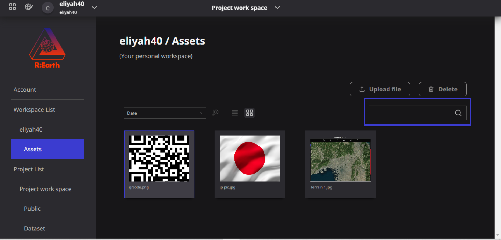

# Manage assets

In terms of Managing Assets in the Re-Earth App, we can do the following:

### Delete assets

To delete an Asset in the **Re-Earth App**, OPEN **Account Settings**-> **Workspace**-> **Assets**

You can delete an image by selecting the Image you want to delete and then, moving your mouse to the top right, you will see the delete button, click on it to delete. 

## Change assets order

Users can change assets order from the sort menu in the modal. Date order is the default order of the change assets Order.

Users can choose from the following three orderings.

- **Date:** Sort by date and time the file was added
- **File Size:** Sort by File size
- **Alphabetical:** Sort by file name in Alphabetical order.

You can change the ascending/descending order by clicking the clock icon next to the pull-down menu.

### Illustration of Change Assets Order

## Change display format

The icons in the center of the modal allow you to change the display format of the assets.

You can select one of the following two display formats for assets.

- **List Format**

- **Lager Format**

## Search

The search bar on the right side of the modal allows you to search for assets by file name.

## Change file name

It is not possible to change the file name of an asset on Re-Earth.

If you need to change the file name, please edit the file name of the data before uploading it, After changing the name upload it again as an asset.