# Various plug-ins

With Re-Earth plugins, you can develop your desired functionalities by combining the "iframe," which displays widgets and info box blocks, with the Re-Earth operating environment called "WebAssembly.”

## Sample

### **Measure the distance from the starting point to the endpoint.**

- [https://test.reearth.dev/published.html?alias=cbbehfijbh](https://test.reearth.dev/published.html?alias=cbbehfijbh)

### Operating Instructions

1. Click on the ruler icon in the top-left corner.
2. Zoom the globe to the desired location you want to measure, then click the Start button.
3. Click on the starting point of the desired location, and a point will be marked.
4. Click on the endpoint of the desired location, and another point will be marked.
5. Click the Finish button and the straight-line distance between the starting and ending points will be measured.
6. If you want to measure again, click the Clear button to start over from 0.

### Image Description

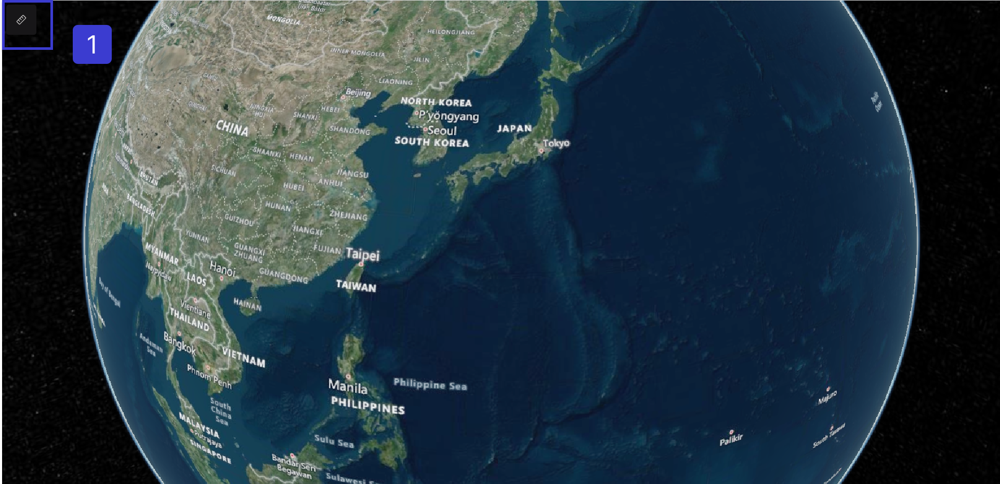

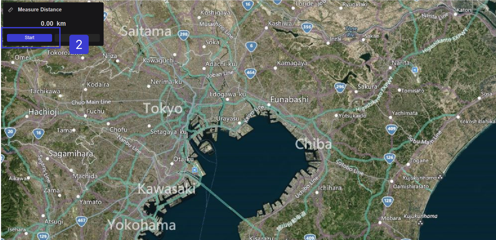

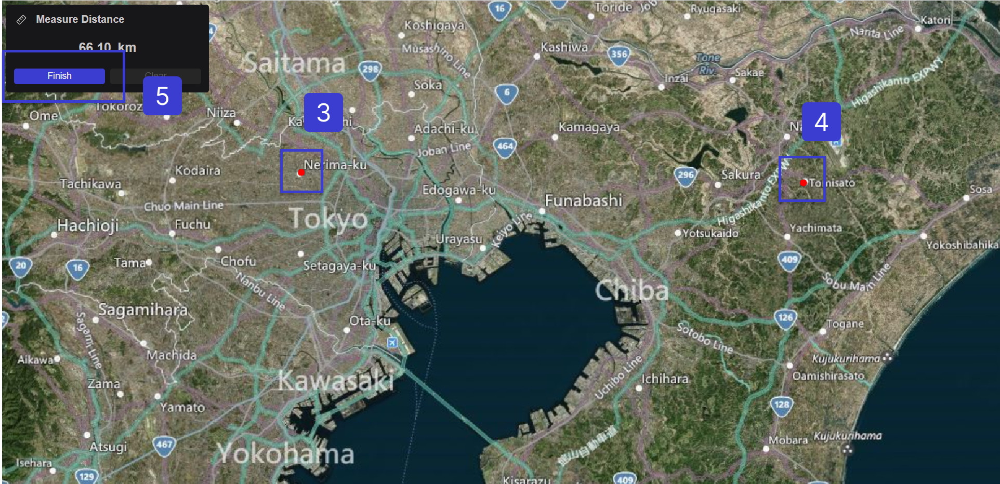

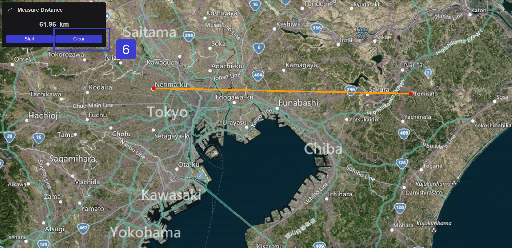

### Get the current location using GPS and move the map to the location.

- Use this Link for easy access [**https://myposition-sample.reearth.io/**](https://myposition-sample.reearth.io/)
1. Once it opens Click on Get Direction.

### Operating Instructions

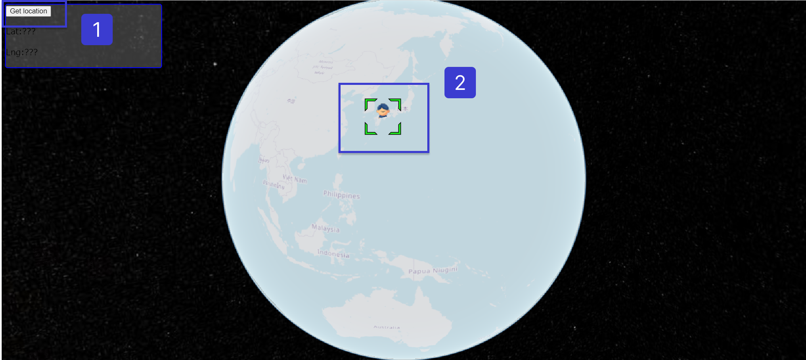

1. The location information will be retrieved, and the person icon will move to the acquired location.

## **Install share buttons for Twitter and Facebook**

- Use this link for easy access to sharing Twitter procedure [https://aehiafdjia.reearth.io/](https://aehiafdjia.reearth.io/) It is the plugin used in sharing location.

### Operating Instructions

**Once you click on this link [https://aehiafdjia.reearth.io/](https://aehiafdjia.reearth.io/) you will be directed to sharing your location on Twitter.**

### How to link and post from Re-Earth to social Media

1. Choose either Twitter or Facebook as the social media platform to share. (In this case, Twitter is selected.)
2. Log in to Twitter.
3. Enter your account information.
4. Enter your password.
5. Click the login button.
6. Review the content that will be posted and click "Tweet" to share.
7. Re-Earth allows you to add a share button for Twitter.

**Selecting the social media platform to share:**

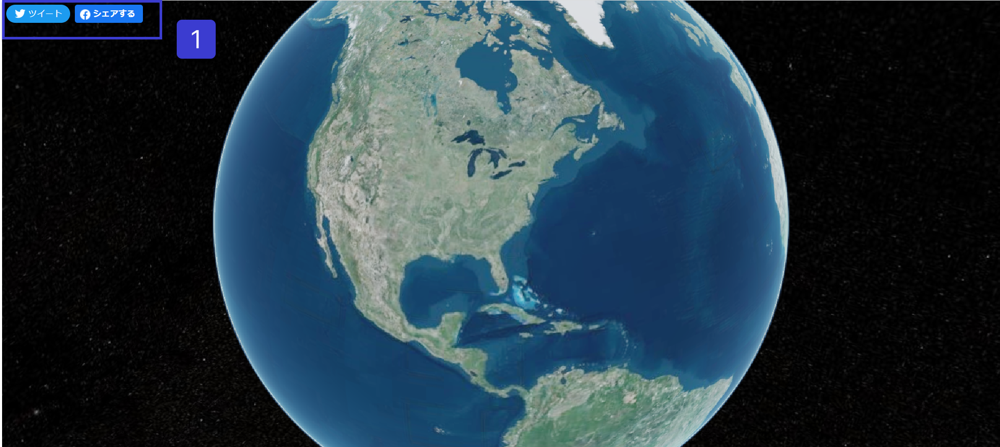

**If you are not logged in or don’t have a Twitter account, Please create a Twitter account and log in** 

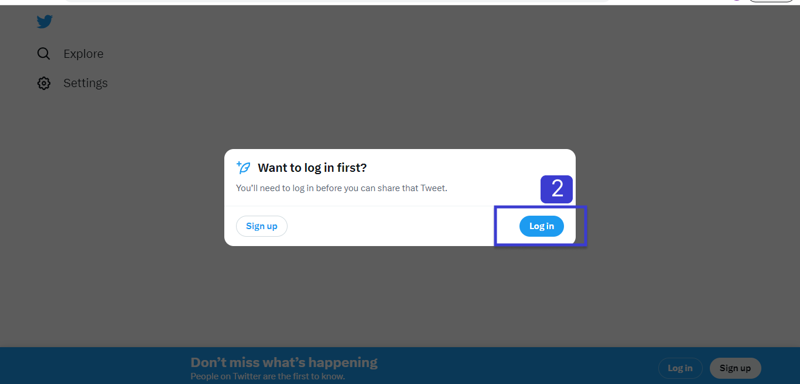

**Click on the login process or create a New Twitter account, if you don’t have any.**

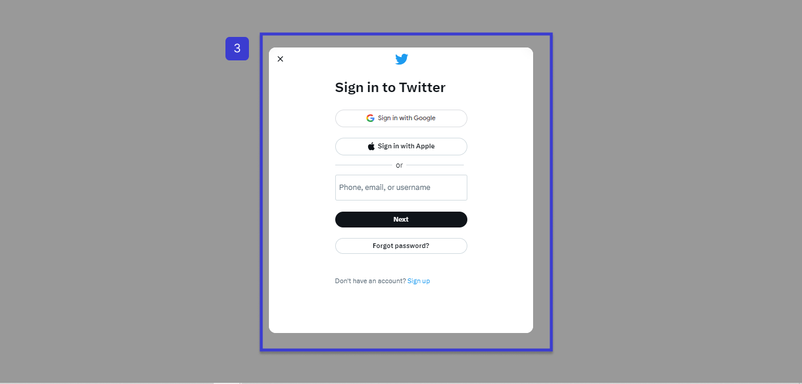

**Enter your password to login into your Twitter account.**

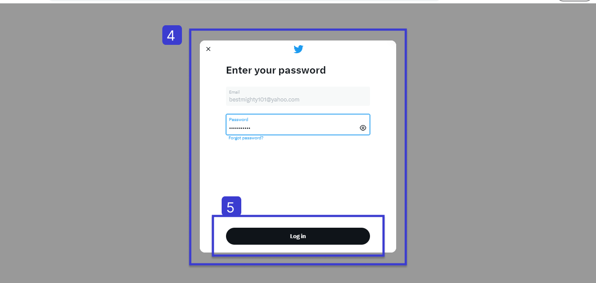

**Click Tweet to share the plugin and your location.**

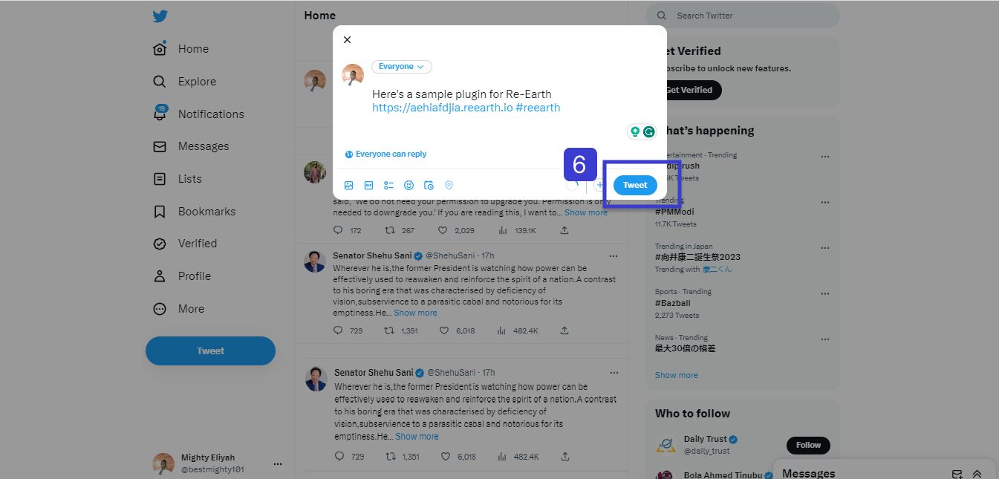

**Your Tweet has been shared.**

## Linking Re-Earth on Social Media

One of the great features of Re-Earth is its ability to integrate with social media platforms. By linking Re-Earth with your social media accounts, you can easily share and interact with content from the platform. Additionally, Re-Earth provides a convenient widget within the info box, allowing you to view news and updates from around the world. 

With the social media integration feature, you can effortlessly connect your Re-Earth account with platforms such as Facebook and Twitter,

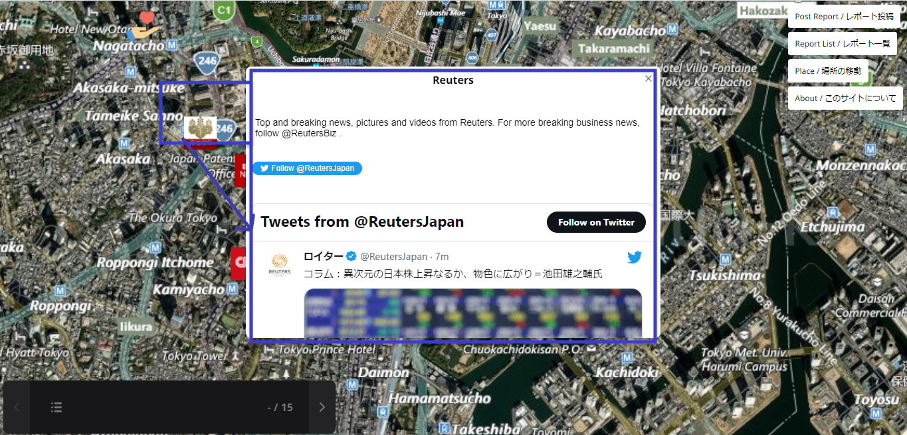

The widget available in the info box provides a dynamic and engaging way to stay updated with global news and current events. By selecting the widget, you can access a curated feed of news articles, blog posts, and other relevant information from various sources. This feature ensures that you can stay informed about the latest developments in the fields of geography, environment, and technology, all within the Re-Earth platform.

When you select each icon on the globe, the corresponding Twitter content will be displayed inside the info box.

Use this Link **([https://peace4ukraine.reearth.io/](https://peace4ukraine.reearth.io/))** to view the global news

### Additionally, it is possible to develop plugins with the following functionalities:

- Loading data from external API sources
- Visualizing real-time data
- Automating specific actions in Re-Earth
- Performing actions in R-Earth using values entered in widgets