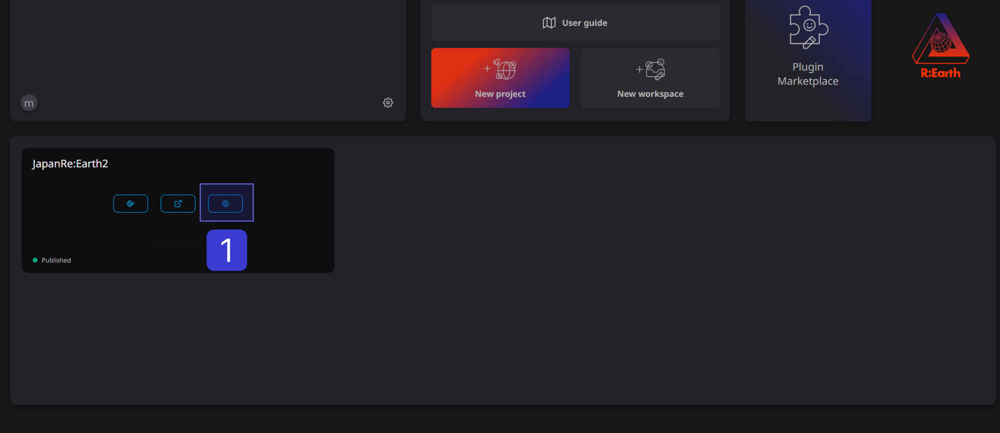
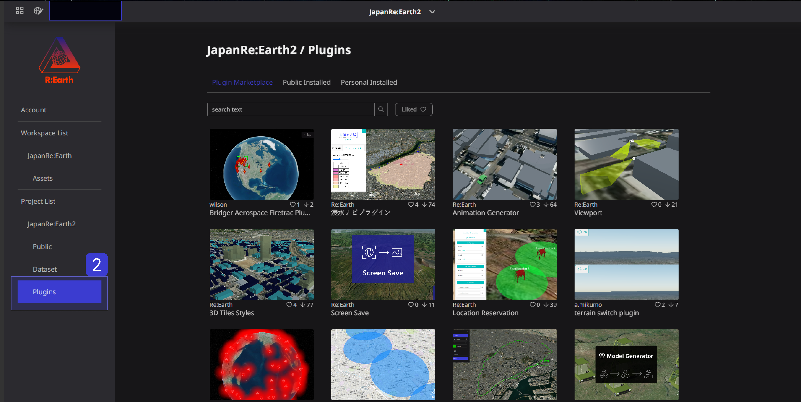
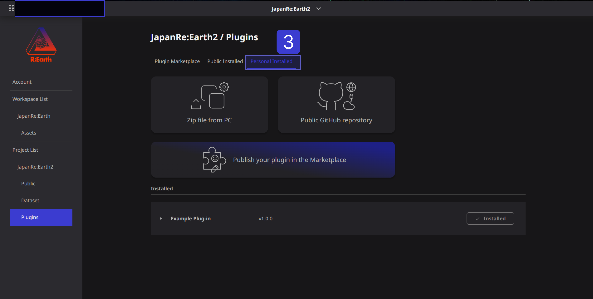
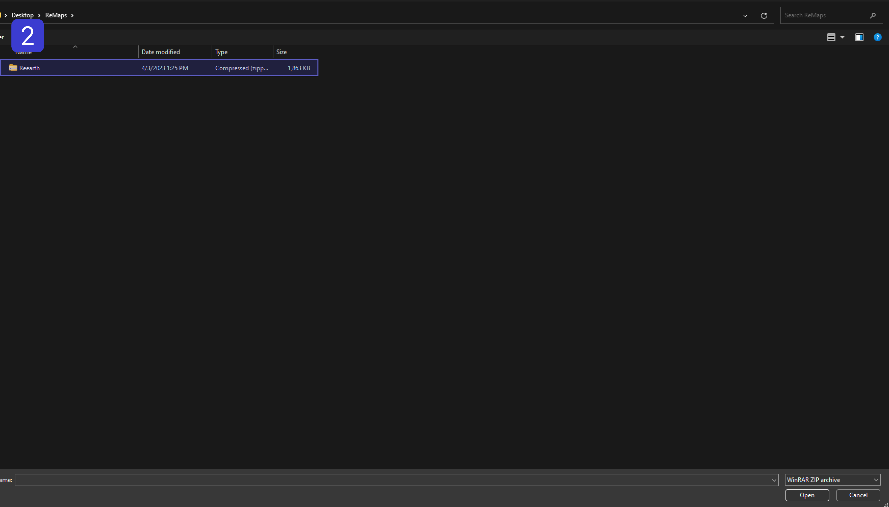
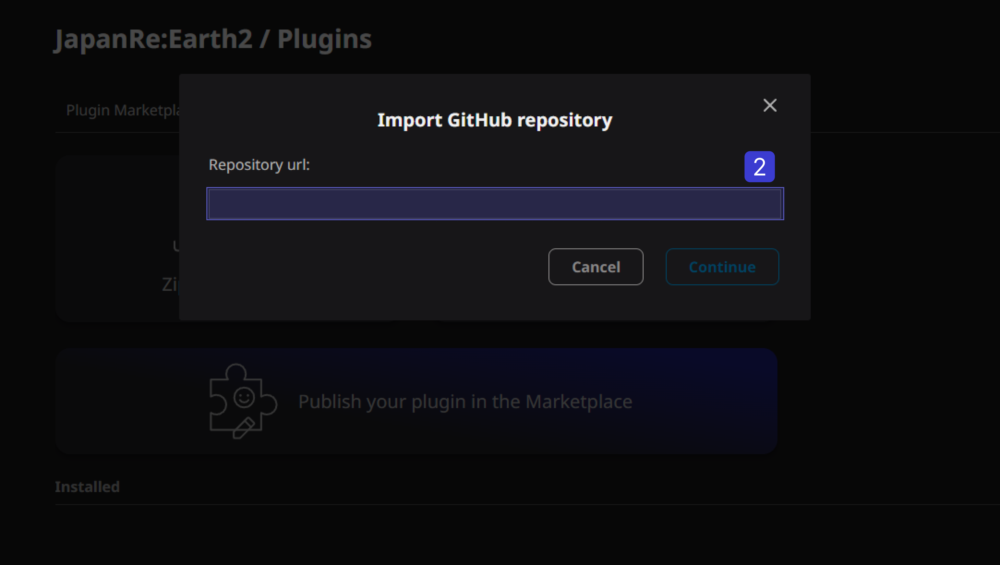
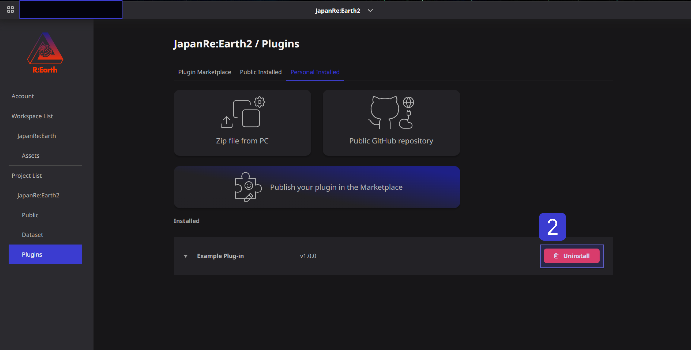
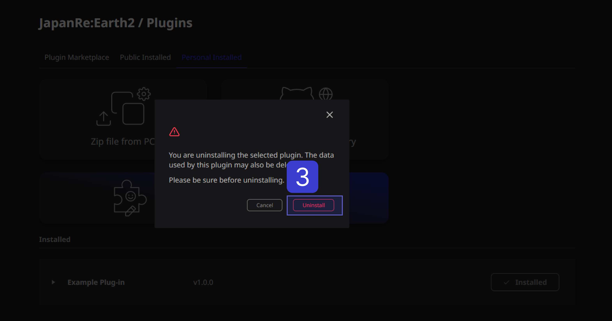
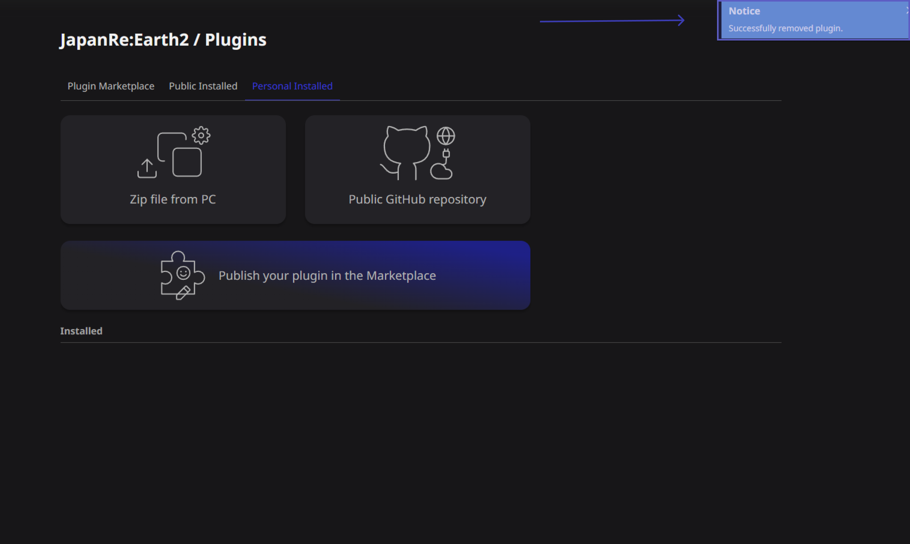

# install and remove plugins.

## How to install and remove plugins.

Installing and removing plugins

### Accessing the plugin library

① Open the project settings screen from the settings button on the dashboard screen.

② Select “Plugins” from the menu on the left.

③ Click “Personally Installed” to access the plug-in library.

### Install plugin

There are two ways to install the plugin.

In "Upload Zip File from PC", select the zip file from your PC to install the plug-in. "GitHub Public Repository" installs the plugin directly from GitHub.

### Upload Zip file from PC

① Access the plugin library and select "Upload Zip file from PC".

.png)

② Select the Zip file.

③If you wait for a while and a notification is displayed, the plug-in has been successfully installed.

.png)

If an error occurs here, the following causes are possible.

There is an error in the format of reearth.yml.

- A plugin with the same ID is already installed. Please remove the existing plugin and run the installation again.
- The ZIP file does not contain reearth.yml or there are multiple directories in the root. Compress a single folder containing reearth.yml or multiple files containing reearth.yml.
- An invalid ZIP file may be output depending on the application that generates the ZIP file. Please compress using other applications.

### GitHub public repository

.png)

② Enter the URL of the GitHub repository.

③ Click the “Continue” button.

.png)

④If you wait for a while and a notification is displayed, the plug-in has been successfully installed.

%201.png)

### Remove plugin

① Access the plugin library and place the cursor on the `installed` button on the right side of the row where the plugin name is displayed.

.png)

② When the "Installed" button changes to "Uninstall", click the Uninstall button.

③ Click the `Uninstall` button on the displayed pop-up.

④If you wait for a while and a notification is displayed, the plug-in has been successfully deleted.

If you remove the plugin, the added widgets and blocks will be removed from the scene. If you have already published scenes that use the removed plugin, widgets and blocks will no longer work in the published scenes.