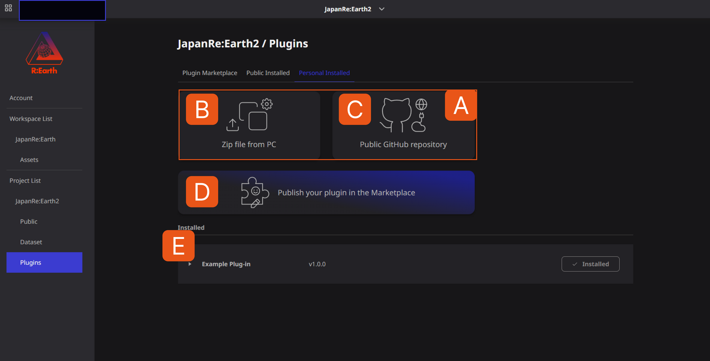

# Overview

## overview

The plugin system is one of Re: Earth's greatest features. You can extend the functionality of Re:Earth by developing your own plugins or using plugins developed by other users in the community.

For example, displaying a new item in the info box that appears when a marker is selected, or placing an original function widget on the screen, executing processing that cannot be achieved with existing Re: Earth functions. becomes possible.

In the future, we plan to make it possible to use plug-ins to perform calculations for streamlining scene editing and data processing.

The Plugin Library page manages plugins for your project.

**A**. It shows how to install the plugin.

**B**. The **Upload Zip File from PC** button selects the zip file from your PC to install the plugin.

**C**. The **GitHub public repository** button installs the plugin directly from GitHub.

**D**. The **Publish your plugin on the marketplace** button allows you to publish your plugin on the marketplace.

**E** .Under **Installed** you will see all the plugins installed in the current project.